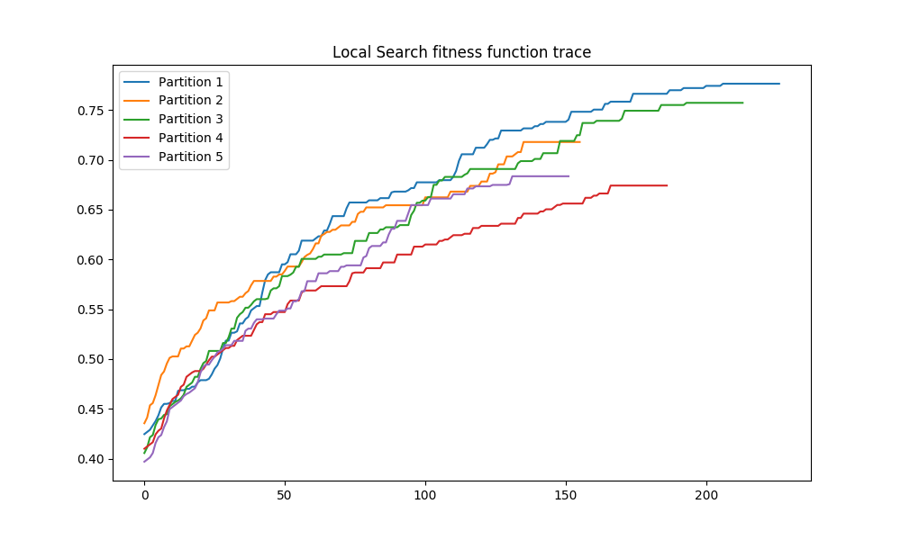

# Descripción del problema

# Descripción de la aplicación de los algoritmos

# Pseudocódigo de los algoritmos

# Algoritmo de comparación

# Proceso de desarrollo

Para la implementación de los algoritmos, tanto Relief como Búsqueda Local
se ha utilizado **Python3**. Las principales fuentes de información utilizadas
para el desarrollo han sido el seminario, el guión de prácticas y la documentación
oficial de Python y los diferentes paquetes utilizados.

Con el fin de reutilizar todo el código posible, he hecho uso extensivo de la
biblioteca de cálculo numérico y manejo de arrays **Numpy**. Esto ha permitido
tener una implementación limpia y concisa (~270 lineas totales) con una velocidad
de ejecución aceptable en comparación con otros lenguajes como C.

También he utilizado algunos **profilers** tanto a nivel de función como a nivel de línea,
para detectar los cuellos de botella en el algoritmo de Búsqueda Local y determinar
finalmente que partes había que optimizar. Como era de esperar esas partes eran
relativas a la función fitness, sobre todo calcular la precisión del clasificador.
Por este motivo hice una búsqueda sobre las formas más eficientes de calcular los vecinos
y encontré la estructura de datos **KDTree**. El uso de la misma ha permitido tener una
implementación más eficiente que usando el típico algoritmo de fuerza bruta.

Además, se realizaron algunas pruebas para optimizar el código compilando parte del mismo
usando Cython, Numba y Pythran las cuáles, desgraciadamente, no resultaron exitosas y las
mejoras que ofrecían no justificaban la complicación en cuanto a desarrollo y distribución
del proyecto.

Finalmente, una vez desarrollado ambos algoritmos, se envolvieron en una clase con
una interfaz similar a los objetos de Scikit-Learn para permitir una integración sencilla con el
resto del código. Con estas dos clases, ya se implemento el programa principal (main).

El programa principal (practica1.py) tiene varias funcionalidades interesantes.
La primera de ellas es la **validación en paralelo** de los clasificadores y salida
bien formateada de los resultados. El programa una vez obtenidos los resultados
genera unos gráficos en formato PNG que se almacenan en la carpeta **output**.
El programa también ofrece una validación de los argumentos recibidos, así como
una pagina de ayuda.


# Manual de usuario

Para poder ejecutar el proyecto es necesario tener instalado **Python3**.
El proyecto no está testeado sobre Anaconda aunque posiblemente funcione.
Únicamente requiere tener el intérprete y el instalador de paquetes
**pip** que suele venir por defecto.

El proyecto tiene una serie de dependencias que son necesarias para
poder ejecutarlo. Mi recomendación es utilizar un entorno virtual de Python
para instalar las dependencias y así no interferir con los paquetes globales.
En el directorio del proyecto **FUENTES**, existe un script llamado **install.sh**
que crea el entorno virtual e instala los paquetes localmente. Los paquetes a
instalar se encuentra en el fichero *requirements.txt*. La lista es larga pero
realmente no se utilizan tantos paquetes explícitamente. Lo que recoge ese archivo
son las dependencias y las "dependencias de las dependencias" con sus versiones
correspondientes para evitar incompatibilidades.

A efectos prácticos, hay que ejecutar únicamente lo siguiente:

```
./FUENTES/install.sh
```

Una vez instalado todo, ya se puede utilizar el programa principal. Este programa
tiene varios parámetros que se deben especificar, el conjunto de datos,
el algoritmo a usar, número de procesos a ejecutar en paralelo, etc.
En cualquier momento podemos acceder a la ayuda ejecutando con la opción **-h**.

```bash
python3 practica1.py -h

usage: practica1.py [-h] --dataset {colposcopy,texture,ionosphere} --algorithm
                    {relief,local-search} --seed SEED [--trace {True,False}]
                    [--n_jobs {1,2,3,4}]

required arguments:
  --dataset {colposcopy,texture,ionosphere}
  --algorithm {relief,local-search}
                        Algorithm to use for feature weighting (default: None)
  --seed SEED

optional arguments:
  --trace {True,False}  Generate trace for local search? (default: False)
  --n_jobs {1,2,3,4}    Number of jobs to run in parallel for evaluating
                        partitions. (default: 1)
```

Así, si queremos ejecutar el algoritmo de Búsqueda Local con el conjunto de datos
Colposcopy, la semilla 1, y en paralelo, ejecutaríamos lo siguiente:

```
python3 practica1.py --dataset=colposcopy --algorithm=local-search --seed 1 --n_jobs=4

========================================================
    COLPOSCOPY     |     LOCAL-SEARCH      |  SEED = 1
========================================================
             Accuracy  Reduction  Aggregation        Time
Partition 1  0.655172   0.682540     0.668856  114.770150
Partition 2  0.793103   0.746032     0.769568  182.226361
Partition 3  0.789474   0.587302     0.688388  166.377363
Partition 4  0.789474   0.603175     0.696324  104.018618
Partition 5  0.754386   0.698413     0.726399   89.622522

         Accuracy  Reduction  Aggregation        Time
Mean     0.756322   0.663492     0.709907  131.403003
Std.Dev  0.058707   0.066780     0.039256   40.553621
Median   0.789474   0.682540     0.696324  114.770150

```

El parámetro **--trace** es muy interesante ya que puesto a True, permite generar
un gráfico de como varía la función fitness a lo largo de las iteraciones.
Obviamente es solamente aplicable para búsqueda local. Un ejemplo de gráfico
es el siguiente:




# Experimentos y Análisis de resultados

## Descripción de los casos del problema

## Resultados obtenidos

## Análisis de los resultados

# Referencias bibliográficas
