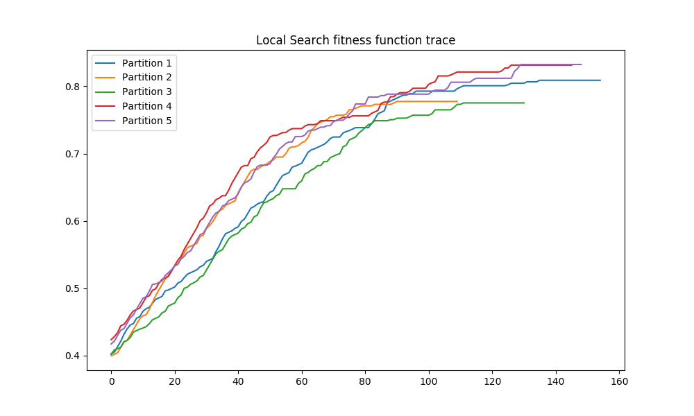
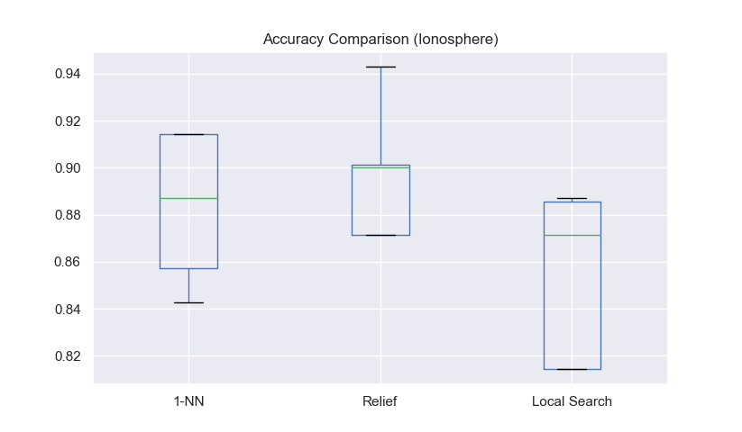
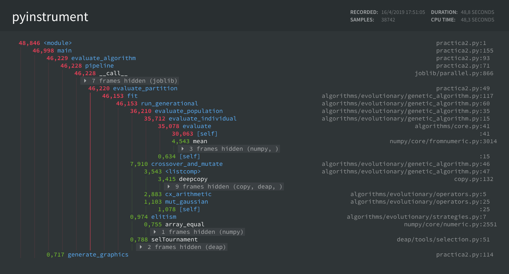
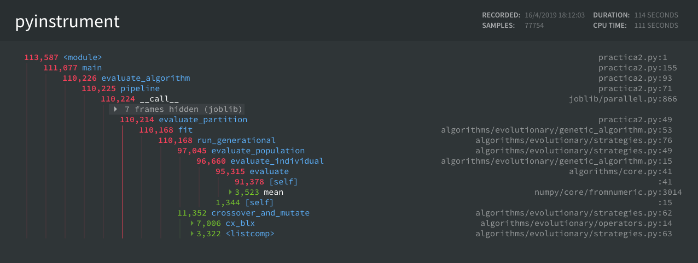

# Descripción del problema
El problema del Aprendizaje de Pesos en Características (APC) es un
problema de búsqueda de codificación real ($sol \in \mathbb{R}^n$).
Consiste en encontrar un vector de pesos que pondere las características
asociadas a un modelo. En este caso utilizamos un modelo no paramétrico llamado KNN.
La ponderación se realiza multiplicando cada característica por su valor correspondiente
dentro del vector de pesos. Es decir, teniendo unos datos de entrada
$X \in \mathbb{R}^{m \times n}$ y un vector de pesos
$\vec{w} = (w_1, w_2,...,w_n)^T \in \mathbb{R}^n$,
multiplicamos cada columna por la componente correspondiente para obtener $X'$.

La ponderación se realiza para obtener un balance óptimo entre precisión
(o cualquier otra métrica que evalúe el modelo) y sencillez. La sencillez
se consigue al eliminar ciertas características cuyo peso está por debajo de un
umbral, en nuestro caso, $0.2$, ya que nos aseguramos que no son demasiado relevantes
para las predicciones. Un modelo no paramétrico como es el caso de KNN tiene la
desventaja de que es costoso hacer predicciones mientras que el tiempo de "fitting"
es casi nulo. Por ese motivo es importante mantener únicamente las características
relevantes para obtener un modelo eficiente. Además, reducimos el riesgo de
sobreajuste ya que obtenemos una función hipótesis más sencilla y menos sensible
al ruido.


Para este problema vamos a utilizar dos métodos de validación.
El primero, un algoritmo de validación cruzada llamado k-fold, que consiste en
dividir el conjunto de entrenamiento en K particiones disjuntas, ajustar el modelo
con $K-1$ particiones y validarlo con la partición restante. El proceso se repite
con todas las combinaciones posibles (K combinaciones). En nuestro caso usamos
$K = 5$, es decir **5-fold cross validation**.

El segundo algoritmo se utiliza para evaluar las soluciones en cada paso de un
algoritmo de búsqueda. Lo que se conoce comúnmente como la función fitness o la
función objetivo. Para ese caso calculamos la precision con Leave-One-Out que
consiste en usar el mismo conjunto de datos tanto para prueba como para validación
pero eliminando la muestra en cuestión antes de predecir para evitar una precisión
errónea del 100%.


Con esto aclarado, podemos definir el marco de trabajo principal de este proyecto,
la función fitness u objetivo y el modelo a utilizar:

$$f(\vec{w}) = \alpha \times precision(\vec{w}, X) + (1 - \alpha) \times reduccion(\vec{w})$$

Donde:
$$
reduccion(\vec{w}) = \frac{\text{nº de componentes < umbral}}{\text{nº de componentes total}}$$
$$precision(\vec{w}, X) = \frac{\text{predicciones correctas ponderando con } \vec{w}}{\text{predicciones totales}}$$

Para reducir el coste computacional de los algoritmos, vamos a utilizar el clasificador
KNN más sencillo usando un solo vecino. Por tanto, para hacer una predicción basta con
hallar la clase del vecino más cercano. Se puede utilizar cualquier medida de distancia,
en nuestro caso usamos la euclídea $\ell_2$ o $\ell_2^2$:

$$vecino(\vec{x}) = \underset{\vec{v} \in X}{\operatorname{argmin}} \ distancia(\vec{x}, \vec{v})$$


# Descripción de la aplicación de los algoritmos

Las soluciones a nuestro problema se representan con un vector de pesos
$\vec{w} = (w_1, w_2,...,w_n)^T \in [0,1]^n$. Por tanto, tenemos que cada componente $w_i$
pondera una característica distinta. Como podemos intuir, características con
un peso próximo a 1 son relevantes para el cálculo de la distancia en KNN
mientras que las que tienen un peso próximo a 0 son prácticamente irrelevantes.

Matemáticamente, la ponderación de pesos podemos verla como una transformación
lineal \
$T: \mathbb{R}^n \rightarrow \mathbb{R}^n, T(\vec{x}) = (w_1 x_i, w_2 x_2,..., w_n x_n)^T$.
Claramente podemos ver la matriz asociada a esta aplicación lineal es la siguiente:

$$M_T =
\begin{bmatrix}
    w_1 & 0 & \dots  & 0 \\
    0 & w_{2} & \dots & 0 \\
    \vdots & \vdots & \ddots & \vdots \\
    0 & 0 & \dots  & w_{n}
\end{bmatrix}
$$

Esta forma de ver la ponderación es importante a la hora de implementarla,
ya que podemos utilizar cualquier biblioteca de cálculo matricial
como BLAS o LAPACK para realizar los cálculos de forma eficiente.
Incluso más eficiente que multiplicar cada columna de la matriz de datos por
su peso correspondiente. Dichas bibliotecas suelen usar instrucciones máquina
óptimas y algoritmos paralelos.

Una vez sabemos como transformar los datos, podemos evaluar diferentes algoritmos
o soluciones. La forma de evaluar cada algoritmo es siempre la misma:

1. Dividimos el conjunto en 5 particiones disjuntas
2. Para cada partición:
    1. Calculamos los pesos usando el algoritmo en cuestión con las particiones restantes
    2. Transformamos los datos tanto de entrenamiento como de prueba con los pesos obtenidos.
    3. Entrenamos un clasificador KNN con los datos de entrenamiento transformados.
    4. Evaluamos el modelo con el conjunto de prueba transformado (la partición).

## KNN

Nuestro clasificador es bastante sencillo de implementar. El pseudocódigo es el siguiente:

```{.pascal caption="Pseudocódigo del clasificador KNN"}
function KNN(x, X, y)
  kdtree = build_KDTree(X)
  nearest_neighbour = KDTree.query(x, k=1)
  return y[nearest_neighbour]
```

Como se puede observar, se utiliza una árbol KDTree para encontrar el vecino más
cercano. Para los conjuntos de datos que estamos utilizando parece una opción
sensata comparada con el típico algoritmo de fuerza bruta. La complejidad temporal
de estos arboles son de $O(n)$ para construirlos y $O(log(n))$ hasta $O(n)$ en el
peor de los casos para consultarlos. Mientras que el algoritmo de fuerza bruta
es $O(n)$ para cada consulta. Si construimos un solo árbol y realizamos muchas
consultas, da un mejor rendimiento que fuerza bruta. **Nota**: Suponemos que el
KDTree al hacer una consulta devuelve un vector de índices correspondiente
a los k vecinos más cercanos.


## Evaluacion

Para evaluar nuestra solución en las diferentes iteraciones de un algoritmo de
búsqueda o una vez entrenado el modelo, se utiliza la siguiente función objetivo:

$$f(\vec{w}) = \alpha \times precision(\vec{w}, X) + (1 - \alpha) \times reduccion(\vec{w})$$

Como hemos visto anteriormente, la precisión indicaría que tan bueno es el clasificador
KNN de un vecino cuando ponderamos con el vector de pesos $\vec{W}$. La precisión
se calcula de dos formas distintas dependiendo de cuando se evalúa.

Si se evalúa con únicamente los datos de entrenamiento, como es el caso
para la búsqueda local o los algoritmos genéticos, 
se utiliza el método Leave-One-Out comentado anteriormente:

```{.pascal caption="Pseudocódigo de la validación Leave-One-Out"}
function accuracy_leave_one_out(X_train, y_train)
  kdtree = build_KDTree(X)
  accuracy = 0
  for x in rows(X_train):
    // Cogemos el segundo más cercano porque el primero es él mismo.
    nearest_neighbour = KDTree.query(x, k=2)[1]
    if y_train[nearest_neighbour] == y_train[x.index] then
      accuracy = accuracy + 1
  return accuracy / num_rows(X_train)
```

Si se evalúa una vez entrenado el modelo con el conjunto de entrenamiento,
se utiliza el conjunto de test para calcular la precision.


```{.pascal caption="Pseudocódigo de la validación Hold-out"}
function accuracy_test(X_train, y_train, X_test, y_test)
  accuracy = 0
  for x in rows(X_test):
    prediction = KNN(x, X_train, y_train)
    if prediction == y_test[x.index] then
      accuracy = accuracy + 1
  return accuracy / num_rows(X_test)
```

Como hemos visto anteriormente, cualquier vector de pesos $\vec{w} \in \mathbb{R}^d$
no es una solución válida. Cada componente debe estar en el intervalo $[0, 1]$
por tanto, es posible que sea necesario capar algunas soluciones. Para ello
se puede usar el siguiente algoritmo


```{.pascal caption="Pseudocódigo de la función clip"}
function clip(w)
  for w_i in components(w):
    if w_i < 0 then; w_i = 0
    if w_i > 1 then; w_i = 1
  return w
```


# Pseudocódigo de los algoritmos

## Búsqueda Local

La búsqueda local ya supone un algoritmo más complejo. En nuestro
caso utilizamos la búsqueda local del primero mejor, es decir,
actualizamos la solución con el primer vecino que tenga un
fitness mayor. La generación de cada vecino se realiza mutando
una componente aleatoria sin repetición. Esta mutación es simplemente
sumar un valor aleatorio de una distribución gaussiana $\mathcal{N}(0, \sigma^2)$.
Donde sigma es 0.3 para nuestro caso. El vector de pesos además se inicializa
aleatoriamente: $\vec{w} = (w_0, w_1,...,w_n)^T$ donde $w_i \sim \mathcal{U}(0, 1)$

El algoritmo se detiene cuando generamos 15000 vecinos o cuando no se produce
mejora tras generar $20n$ vecinos, donde $n$ es el número de características
de nuestro conjunto de datos.


```{.pascal caption="Pseudocódigo del algoritmo de Búsqueda Local"}
function local_search(X, y, max_neighbours, sigma, seed):
    n_features = num_columns(X)
    feed_random_generator(seed)
    weights = generate_random_uniform_vector(n_features, 0, 1)
    fitness = evaluate(weights, X, y)
    n_generated = 0
    last_improvement = 0
    while n_generated < max_neighbours:
        w_prime = copy(weights)
        for k in permutation(n_features):
            n_generated += 1
            last_state = w_prime[k]
            w_prime[k] += generate_gaussian(0, sigma)
            w_prime = clip(w_prime)
            f = evaluate(w_prime, X, y)
            if fitness < f then
                weights = w_prime
                fitness = f
                last_improvement = n_generated
                break
            else then
              w_prime[k] = last_state
            diff = n_generated - last_improvement
            if n_generated > max_neighbours or diff > (20 * n_features):
                return weights
    return weights
```


La función *evaluate* utilizada en el algoritmo únicamente transforma los
datos con los pesos correspondientes y calcula el fitness de la solución.

```{.pascal caption="Pseudocódigo del la función evaluadora de soluciones para Búsqueda Local"}
function evaluate(weights, X, y):
    // Aplicar la ponderación y eliminar las características
    // con un peso menor a 0.2
    X_transformed = transform(weights, X)
    accuracy = knn_accuracy_leave_one_out(X_transformed, y)
    return fitness(weights, accuracy)
```

```{.pascal caption="Pseudocódigo del la función fitness"}
function fitness(weights, accuracy, alpha=0.5, threshold=0.2):
    reduction = count(weights < threshold) / length(weights)
    return alpha * accuracy + (1 - alpha) * reduction
```


## Algoritmos genéticos

### Operadores

### Estrategias


## Algoritmos meméticos

# Algoritmo de comparación

## Relief

La implementación del algoritmo greedy Relief es bastante
sencilla. Para cada muestra en el conjunto de entrenamiento
calculamos el amigo (sin contar el mismo) y el enemigo más próximos,
y actualizamos el vector de pesos con las distancias de cada uno
hacia el punto en cuestión.

```{.pascal caption="Pseudocódigo del algoritmo greedy Relief"}
function relief(X, Y):
    w = {0, 0,..., 0}
    for i=0 to rows_count(X):
        x, y = X[i], Y[i]
        X_same_class = X[Y == y]
        X_other_class = X[Y != y]
        kdtree1 = build_KDTree(X_same_class)
        kdtree2 = build_KDTree(X_other_class)
        ally = kdtree1.query(x, k=2)[1]
        enemy = kdtree2.query(x, k=1)[0]
        ally = X_same_class[ally]
        enemy = X_other_class[enemy]
        w += abs(x - enemy) - abs(x - ally)
    w = clip(w)
    w = w * (1 / max(w))
    return w
```

Como se puede observar, el algoritmo crea dos árboles KDTree en cada
iteración lo cuál no es muy eficiente. El forma ideal sería crear un
árbol para cada clase antes del bucle y utilizarlos dentro del bucle,
pero el algoritmo de por sí ya es bastante eficiente y por legibilidad
del código se ha descartado esa opción.

# Proceso de desarrollo

Para la implementación de todos los algoritmos,
se ha utilizado **Python3**. Las principales fuentes de información utilizadas
para el desarrollo han sido el seminario, el guión de prácticas y la documentación
oficial de Python y los diferentes paquetes utilizados.

Con el fin de reutilizar todo el código posible, he hecho uso extensivo de la
biblioteca de cálculo numérico y manejo de arrays **Numpy**. Esto ha permitido
tener una implementación limpia y concisa (~300 lineas totales) con una velocidad
de ejecución aceptable en comparación con otros lenguajes como C.

Para la implementación de los algoritmos evolutivos se ha utilizado el framework
DEAP, que permite de una forma concisa y eficiente implementar todo tipo de
estrategias evolutivas. Se ha usado además para reutilizar algunos operadores
como el torneo binario.

También he utilizado algunos **profilers** tanto a nivel de función como a nivel de línea,
para detectar los cuellos de botella en el algoritmo de Búsqueda Local y determinar
finalmente que partes había que optimizar. Como era de esperar esas partes eran
relativas a la función fitness, sobre todo calcular la precisión del clasificador.
Por este motivo hice una búsqueda sobre las formas más eficientes de calcular los vecinos
y encontré la estructura de datos **KDTree**. El uso de la misma ha permitido tener una
implementación más eficiente que usando el típico algoritmo de fuerza bruta.

Además, se realizaron algunas pruebas para optimizar el código compilando parte del mismo
usando Cython, Numba y Pythran las cuáles, desgraciadamente, no resultaron exitosas y las
mejoras que ofrecían no justificaban la complicación en cuanto a desarrollo y distribución
del proyecto.

Finalmente, una vez desarrollado los algoritmos, se envolvieron en una clase con
una interfaz similar a los objetos de Scikit-Learn para permitir una integración 
sencilla con el resto del código. Con estas dos clases, ya se implementó el 
programa principal.

El programa principal (*practica2.py*) tiene varias funcionalidades interesantes.
La primera de ellas es la **validación en paralelo** de los clasificadores y salida
bien formateada de los resultados. El programa una vez obtenidos los resultados
genera unos gráficos en formato PNG que se almacenan en la carpeta **output**.
Los resultados se pueden también exportar en formato "xslx" de Excel.
El programa ofrece una validación de los argumentos recibidos, así como
una página de ayuda.


# Manual de usuario

Para poder ejecutar el proyecto es necesario tener instalado **Python3**.
El proyecto no está testeado sobre Anaconda aunque posiblemente funcione.
Únicamente requiere tener el intérprete y el instalador de paquetes
**pip** que suele venir por defecto.

El proyecto tiene una serie de dependencias que son necesarias para
poder ejecutarlo. Mi recomendación es utilizar un entorno virtual de Python
para instalar las dependencias y así no interferir con los paquetes globales.
En el directorio del proyecto **FUENTES**, existe un script llamado **install.sh**
que crea el entorno virtual e instala los paquetes localmente. Los paquetes a
instalar se encuentra en el fichero "requirements.txt". La lista es larga pero
realmente no se utilizan tantos paquetes explícitamente. Lo que recoge ese archivo
son las dependencias y las "dependencias de las dependencias" con sus versiones
correspondientes para evitar incompatibilidades.

A efectos prácticos, hay que ejecutar únicamente lo siguiente:

```{.bash caption="Ejecución del script para instalar las dependencias"}
./FUENTES/install.sh
source ./env/bin/activate
```

> **Nota:** Si se produce un error al instalar el módulo pykdtree es porque su compilador
por defecto no soporta OpenMP. Este error se puede obviar ya que la aplicación usará
otro módulo en su lugar.

Una vez instalado todo, ya se puede utilizar el programa principal. Este programa
tiene varios parámetros que se deben especificar: el conjunto de datos,
el algoritmo a usar, número de procesos a ejecutar en paralelo, etc.
En cualquier momento podemos acceder a la ayuda con **-h**.

```{.bash caption="Salida de la página de ayuda"}
➜ python3 practica2.py -h
usage: practica2.py [-h] [--seed SEED] [--n_jobs {1,2,3,4}] [--trace]
                    [--to_excel]
                    dataset
                    {knn,relief,local-search,
                    agg-blx,agg-ca,age-blx,age-ca,
                    AM-(1,1.0),AM-(1,0.1),AM-(1,0.1mej)}

positional arguments:
  dataset               Predefined datasets or a csv file
  {knn,relief,local-search,agg-blx,agg-ca,age-blx,age-ca,
    AM-(1,1.0),AM-(1,0.1),AM-(1,0.1mej)} Algorithm to use for feature weighting

optional arguments:
  -h, --help            show this help message and exit
  --seed SEED           Seed to initialize the random generator (default:
                        77766814)
  --n_jobs {1,2,3,4}    Number of jobs to run in parallel to evaluate
                        partitions. (default: 1)
  --trace               Generate trace for local search (default: False)
  --to_excel            Dump results into xlsx file (default: False)
```

Así, si queremos ejecutar el algoritmo de AM-(1,1.0) con el conjunto de datos
Colposcopy, la semilla 1, y en paralelo, ejecutaríamos lo siguiente:

```{caption="Salida del programa principal"}

python3 practica2.py colposcopy 'AM-(1,1.0)' --seed=1 --n_jobs=4

=======================================================
    COLPOSCOPY     |     AM-(1,1.0)      |  SEED = 1
=======================================================
             Accuracy  Reduction  Aggregation       Time
Partition 1  0.694915   0.951613     0.823264  10.574860
Partition 2  0.666667   0.935484     0.801075  10.933312
Partition 3  0.631579   0.935484     0.783531  11.138601
Partition 4  0.666667   0.935484     0.801075  10.324892
Partition 5  0.719298   0.951613     0.835456   6.054140

         Accuracy  Reduction  Aggregation       Time
Mean     0.675825   0.941935     0.808880   9.805161
Std.Dev  0.033090   0.008834     0.020479   2.120348
Median   0.666667   0.935484     0.801075  10.574860
```

> **NOTA:** La semilla por defecto es 77766814. Es la semilla utilizada para el
análisis de resultados.

El parámetro *--trace* es muy interesante ya que puesto a True, permite generar
un gráfico de como varía la función fitness a lo largo de las iteraciones.
Obviamente no es aplicable para Relief. Un ejemplo de gráfico
es el siguiente:



Además, la aplicación puede leer cualquier archivo **csv**, en el parámetro
dataset únicamente hay que especificar el path del archivo. El único requisito
es que la variable a predecir se encuentre en la última columna. Esta variable
no hace falta que esté codificada en enteros, puede ser cualquier variable categórica,
el sistema se encarga de codificarla.


# Experimentos y Análisis de resultados

## Descripción de los casos del problema


Los conjuntos de datos utilizados son los siguientes:

1. **Colposcopy:** Este conjunto de datos tiene 287 muestras y 62 características
reales extraídas de imágenes colposcópicas. El objetivo es clasificar entre
positivo y negativo (clasificación binaria).

2. **Ionosphere**: Este conjunto consta de 352 muestras y 34 características extraídas
de datos de radares. Al igual que el conjunto anterior, la variable explicada es
categórica binaria.

3. **Texture**: Diferentes imágenes de texturas se han procesado para extraer 550
muestras y 40 atributos. En este caso la clasificación es entre 11 categorías distintas.

## Resultados obtenidos

Para realizar los experimentos se utilizado una semilla específica, mi DNI: 77766814.
La semilla se ha utilizado tanto para los algoritmos probabilísticos como para crear
las particiones k-fold del conjunto de datos. La funcionalidad de ejecutar la validación
en paralelo está implementada y funciona correctamente, pero se ha utilizado un único
proceso para evaluar todas las particiones y así, obtener tiempos mínimos de cada algoritmo.
Los resultados de la ejecución de los algoritmos son los siguientes:


## Análisis de los resultados

Antes de continuar con el análisis de los resultados es importante mencionar que las muestras
recogidas, pese a haberse obtenido en las mismas condiciones (misma semilla), son bastante
pequeñas. Se han realizado únicamente 5 particiones por conjunto de datos, lo que nos da
una muestra demasiado pequeña que nos impide realizar cualquier test de hipótesis
paramétrico. Incluso si realizásemos un test no paramétrico como el test Anderson-Darling,
las conclusiones podrían no ser correctas y podríamos cometer errores de Tipo I o Tipo 2
(falsos positivos o falsos negativos).


Por lo explicado anteriormente, cualquier conclusión que saquemos con los datos recogidos
pueden no ser extrapolables al resto de situaciones. Aún así, es importante comparar los
resultados para entender que algoritmos funcionan mejor sobre nuestros conjuntos de datos
específicos y sus particiones correspondientes.

En primer lugar, vemos que el algoritmo 1-NN básico aporta un porcentaje de precisión alto
en los casos *Ionosphere* y *Texture* y un porcentaje no tan alto en el conjunto
*Colposcopy*. Si bien la métrica de la precisión puede ser válida en *Texture*, para
los otros dos conjuntos puede no funcionar tan bien. Lo ideal sería utilizar
alguna otra métrica como AUC, F1-Score, etc. Pero como nuestro objetivo es comparar
diferentes algoritmos que utilizan la misma métrica, este detalle no es relevante.


Para el caso *Colposcopy* vemos que el clasificador básico tiene una precisión muy
próxima a las versiones Relief y Búsqueda Local. Incluso una precisión mayor que este
último. Para el algoritmo Relief, sorprendentemente, en ese conjunto la reducción es
considerable y la precisión se mantiene con respecto a 1-NN, por tanto, podríamos decir
que funciona bastante bien para este dataset en concreto. Para el algoritmo de 
Búsqueda local es importante recalcar una cosa. La diferencia de precision entre 
1-NN y este algoritmo, es de tan solo 3%. Es decir, hemos perdido un 3% de precisión usando 
únicamente el 23% de las características. Esto implica que nuestro algoritmo 
posiblemente vaya a generalizar mucho mejor que el clasificador 1-NN y el coste 
computacional de predecir nuevos valores se va a reducir drásticamente. 
El inconveniente principal de este algoritmo en este conjunto de datos (y en general),
es el tiempo de preprocesado. Para obtener los pesos correspondientes tarda de 
media ~8s, lo cuál es bastante mayor que los otros dos algoritmos comparados aunque 
no es un tiempo desmesurado.


Lo importante de los algoritmos de APC que estamos implementado es que una vez calculado
los pesos óptimos para un conjunto de datos, se validan, y quedan prefijados para el resto
del desarrollo. Esto hace que en fases posteriores, realizar predicciones sea mucho más
eficiente. Si nos fijamos, se consigue más de un 82% de reducción de media entre los tres
conjuntos de datos. Por otra parte, si nuestro objetivo es la inferencia, podemos saber
que características tienen más importancia que otras cuando nos enfrentamos a algoritmos
de aprendizaje "black-box", los cuales son difíciles de interpretar, pero con estos métodos
podemos desentrañar parte de la información que aprenden. Por estos motivos, los altos
tiempos de ejecución del algoritmo BL, los cuáles en realidad no son tan altos comparados
con técnicas como hyperparametrización, no deben ser limitantes a la hora de usarlo como
parte de un flujo de trabajo en Aprendizaje Automático.


Algo similar pasa con el resto de casos. El algoritmo Relief esta vez si que mejora
la precisión con respecto al 1-NN. Ahora si podemos decir que este algoritmo funciona
correctamente para estos casos particulares, aunque la reducción es muy baja. 
Cumple su objetivo que es maximizar el rendimiento del modelo ponderando pero sin 
reducir las características. Por otra parte, la búsqueda local podríamos decir 
que es el algoritmo que menor precisión tiene. Esto es debido a que la función 
fitness pondera por igual la reducción y la precisión por tanto la precisión se 
me un poco mermada. Aun así, como hemos comentado antes, la diferencia en precisión 
entre Búsqueda local y el resto de algoritmos no es demasiado grande mientras que 
la reducción es considerable.


>**Nota**: Cuando hablamos de que la diferencia entre precisiones no es demasiado grande,
hablamos para estos conjuntos en particular y sin conocimiento previo de la utilización
del modelo. En situaciones donde la precisión sea muy importante, como puede ser en 
evaluaciones médicas, detección de fraude, etc...
Si que tendríamos que tener en cuenta estas diferencias. En estos casos, deberíamos
ajustar el parámetro $\alpha$ para ponderar más la precisión, por ejemplo $\alpha=0.75$.


Como conclusión final, podríamos decir que usar una buena implementación del algoritmo
de búsqueda local que sea escalable para problemas reales con espacios dimensionales
más grandes que los aquí utilizados, puede ser una buena estrategia para reducir la
dimensionalidad del problema, mejorar la eficiencia en predicciones, interpretar
modelos "black-box" o reducir la varianza.

## Gráficos

Como parte final del análisis, voy a mostrar varios gráficos explicativos generados
tras realizar los experimentos:


Esto es uno de los gráficos generados por la aplicación. Como vemos, el valor de la
función fitness aumenta rápidamente en las primeras iteraciones y posteriormente se
estabiliza lo que nos da un indicio de que el algoritmo ha convergido o ronda muy próximo
a un máximo local. Como vemos en cada partición se llega a un máximo distinto. Esto
es debido a que cada partición representa un conjunto de datos totalmente distinto
y por tanto la función fitness tiene una geometría distinta. En todas las particiones
se utiliza el mismo valor de inicialización, por tanto el punto de inicio es el mismo
haciendo que este factor no influya.

Podemos también comparar los algoritmos a partir de los datos recogidos de forma visual:





Estos gráficos reflejan la relevancia de las particiones en los conjuntos de datos.
Para el algoritmo básico, las muestras de precisión están siempre en el rango intercuartílico
incluso para *Ionosphere* los datos son simétricos. Mientras que para los algoritmos Relief
y Búsqueda local existen dos casos donde hay outliers. Para Relief, esto es debido a
la naturaleza greedy del algoritmo y para búsqueda local esto es debido a lo comentado
anteriormente sobre convergencia. Cada partición de datos genera un función fitness con
una geometría distinta, por tanto un búsqueda local puede hacer que lleguemos
a máximos totalmente distintos en cada caso. A modo de resumen, podríamos decir
que los algoritmos Relief y Búsqueda Local son más sensibles a los cambios en las particiones
de datos que el clasificador 1-NN básico.


\pagebreak


## Analizando la diferencia de tiempos

### Diferencias entre Algoritmos Evolutivos y Búsqueda Local



### Diferencias entre BLX y Cruce Aritmético




# Referencias bibliográficas

## Entendimiento

Al principio, pese a lo básico del algoritmo, no llegaba a comprender como funcionaba
realmente Relief. Este paper me fue de gran ayuda:

[RELIEF Algorithm and Similarity Learning for K-NN](
https://www.academia.edu/2675771/RELIEF_Algorithm_and_Similarity_Learning_for_k-NN)

## Implementación

Para la implementación he utilizado la documentación oficial de Python y sus bibliotecas
correspondientes:

- [Python3 Docs](https://docs.python.org/3/index.html)

- [Scipy-Suite](https://www.scipy.org/)

- [Scikit-Learn](http://scikit-learn.sourceforge.net/stable/index.html)

- [joblib (Paralelismo)](https://joblib.readthedocs.io/en/latest/)

- [KDTree](https://stackoverflow.com/questions/48126771/nearest-neighbour-search-kdtree)

- [Deap](https://deap.readthedocs.io/en/master/index.html)
