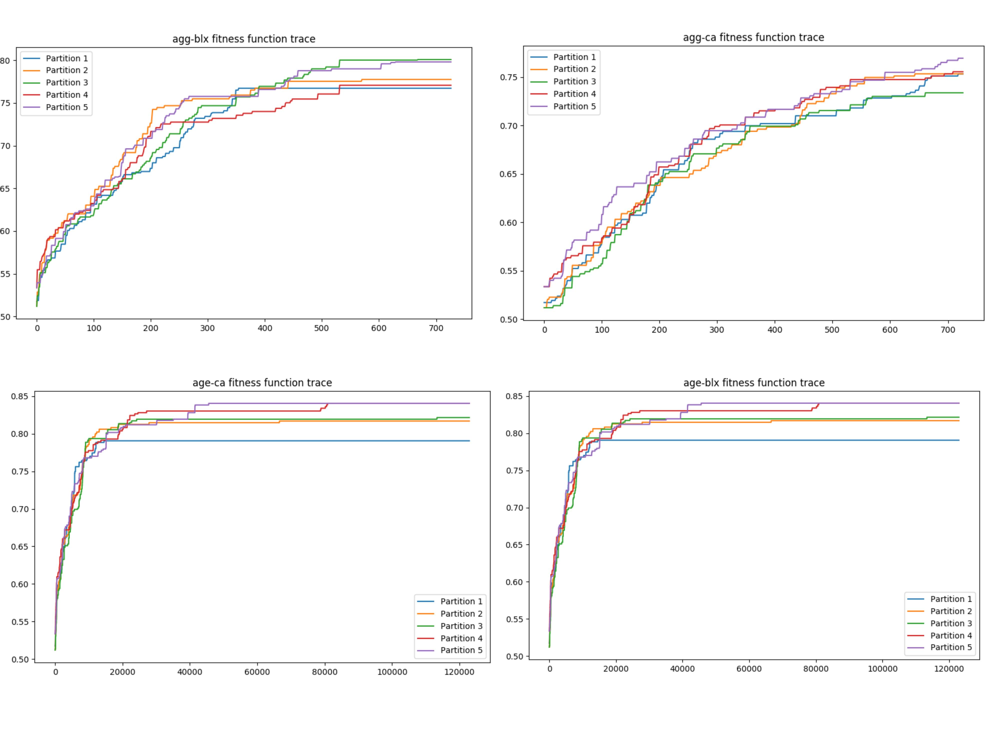
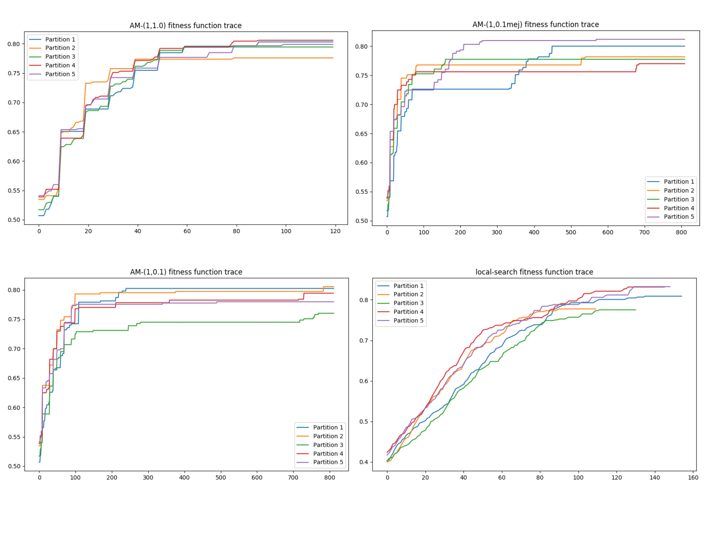
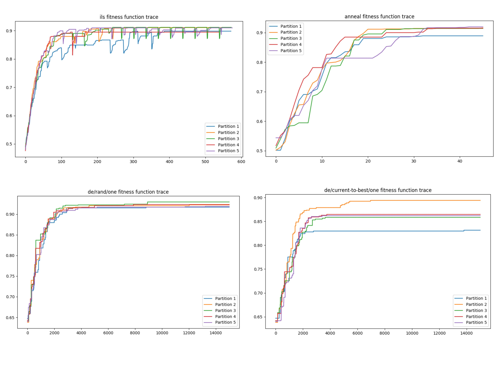
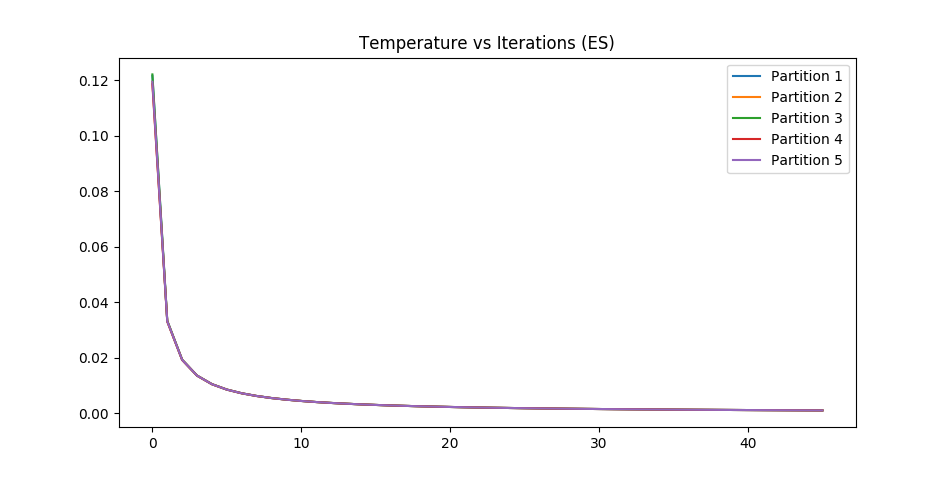
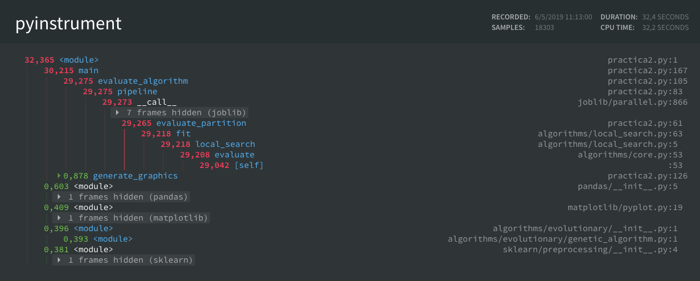
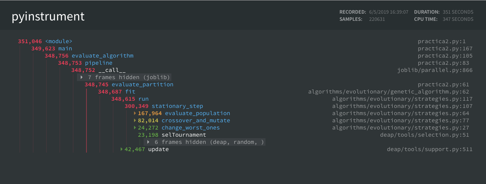
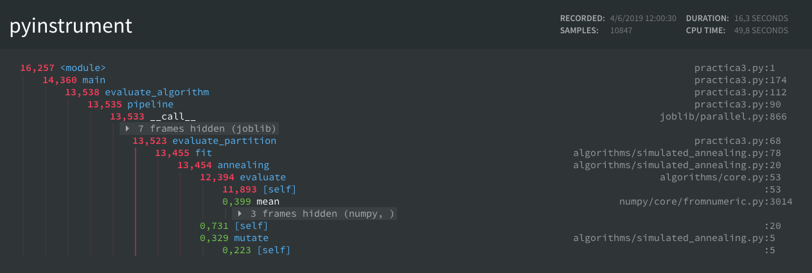
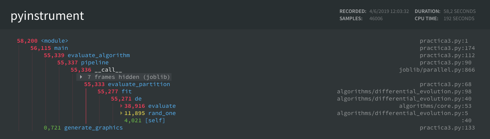

Descripción del problema
========================

El problema del Aprendizaje de Pesos en Características (APC) es un
problema de búsqueda de codificación real ($sol \in \mathbb{R}^n$).
Consiste en encontrar un vector de pesos que pondere las características
asociadas a un modelo. En este caso utilizamos un modelo no paramétrico
llamado KNN. La ponderación se realiza multiplicando cada característica
por su valor correspondiente dentro del vector de pesos. Es decir,
teniendo unos datos de entrada $X \in \mathbb{R}^{m \times n}$ y un
vector de pesos $\vec{w} = (w_1, w_2,...,w_n)^T \in \mathbb{R}^n$,
multiplicamos cada columna por la componente correspondiente para
obtener $X'$.

La ponderación se realiza para obtener un balance óptimo entre precisión
(o cualquier otra métrica que evalúe el modelo) y sencillez. La
sencillez se consigue al eliminar ciertas características cuyo peso está
por debajo de un umbral, en nuestro caso, $0.2$, ya que nos aseguramos
que no son demasiado relevantes para las predicciones. Un modelo no
paramétrico como es el caso de KNN tiene la desventaja de que es costoso
hacer predicciones mientras que el tiempo de "fitting" es casi nulo. Por
ese motivo es importante mantener únicamente las características
relevantes para obtener un modelo eficiente. Además, reducimos el riesgo
de sobreajuste ya que obtenemos una función hipótesis más sencilla y
menos sensible al ruido.

Para este problema vamos a utilizar dos métodos de validación. El
primero, un algoritmo de validación cruzada llamado k-fold, que consiste
en dividir el conjunto de entrenamiento en K particiones disjuntas,
ajustar el modelo con $K-1$ particiones y validarlo con la partición
restante. El proceso se repite con todas las combinaciones posibles (K
combinaciones). En nuestro caso usamos $K = 5$, es decir **5-fold cross
validation**.

El segundo algoritmo se utiliza para evaluar las soluciones en cada paso
de un algoritmo de búsqueda. Lo que se conoce comúnmente como la función
fitness o la función objetivo. Para ese caso calculamos la precision con
Leave-One-Out que consiste en usar el mismo conjunto de datos tanto para
prueba como para validación pero eliminando la muestra en cuestión antes
de predecir para evitar una precisión errónea del 100%.

Con esto aclarado, podemos definir el marco de trabajo principal de este
proyecto, la función fitness u objetivo y el modelo a utilizar:

$$f(\vec{w}) = \alpha \times precision(\vec{w}, X) + (1 - \alpha) \times reduccion(\vec{w})$$

Donde: $$
reduccion(\vec{w}) = \frac{\text{nº de componentes < umbral}}{\text{nº de componentes total}}$$
$$precision(\vec{w}, X) = \frac{\text{predicciones correctas ponderando con } \vec{w}}{\text{predicciones totales}}$$

Para reducir el coste computacional de los algoritmos, vamos a utilizar
el clasificador KNN más sencillo usando un solo vecino. Por tanto, para
hacer una predicción basta con hallar la clase del vecino más cercano.
Se puede utilizar cualquier medida de distancia, en nuestro caso usamos
la euclídea $\ell_2$ o $\ell_2^2$:

$$vecino(\vec{x}) = \underset{\vec{v} \in X}{\operatorname{argmin}} \ distancia(\vec{x}, \vec{v})$$

Descripción de la aplicación de los algoritmos
==============================================

Las soluciones a nuestro problema se representan con un vector de pesos
$\vec{w} = (w_1, w_2,...,w_n)^T \in [0,1]^n$. Por tanto, tenemos que
cada componente $w_i$ pondera una característica distinta. Como podemos
intuir, características con un peso próximo a 1 son relevantes para el
cálculo de la distancia en KNN mientras que las que tienen un peso
próximo a 0 son prácticamente irrelevantes.

Matemáticamente, la ponderación de pesos podemos verla como una
transformación lineal\
$T: \mathbb{R}^n \rightarrow \mathbb{R}^n, T(\vec{x}) = (w_1 x_i, w_2 x_2,..., w_n x_n)^T$.
Claramente podemos ver la matriz asociada a esta aplicación lineal es la
siguiente:

$$M_T =
\begin{bmatrix}
    w_1 & 0 & \dots  & 0 \\
    0 & w_{2} & \dots & 0 \\
    \vdots & \vdots & \ddots & \vdots \\
    0 & 0 & \dots  & w_{n}
\end{bmatrix}
$$

Esta forma de ver la ponderación es importante a la hora de
implementarla, ya que podemos utilizar cualquier biblioteca de cálculo
matricial como BLAS o LAPACK para realizar los cálculos de forma
eficiente. Incluso más eficiente que multiplicar cada columna de la
matriz de datos por su peso correspondiente. Dichas bibliotecas suelen
usar instrucciones máquina óptimas y algoritmos paralelos.

Una vez sabemos como transformar los datos, podemos evaluar diferentes
algoritmos o soluciones. La forma de evaluar cada algoritmo es siempre
la misma:

1.  Dividimos el conjunto en 5 particiones disjuntas
2.  Para cada partición:
    1.  Calculamos los pesos usando el algoritmo en cuestión con las
        particiones restantes
    2.  Transformamos los datos tanto de entrenamiento como de prueba
        con los pesos obtenidos.
    3.  Entrenamos un clasificador KNN con los datos de entrenamiento
        transformados.
    4.  Evaluamos el modelo con el conjunto de prueba transformado (la
        partición).

KNN
---

Nuestro clasificador es bastante sencillo de implementar. El
pseudocódigo es el siguiente:

``` {.pascal caption="Pseudocódigo del clasificador KNN"}
function KNN(x, X, y)
  kdtree = build_KDTree(X)
  nearest_neighbour = KDTree.query(x, k=1)
  return y[nearest_neighbour]
```

Como se puede observar, se utiliza una árbol KDTree para encontrar el
vecino más cercano. Para los conjuntos de datos que estamos utilizando
parece una opción sensata comparada con el típico algoritmo de fuerza
bruta. La complejidad temporal de estos arboles son de $O(n)$ para
construirlos y $O(log(n))$ hasta $O(n)$ en el peor de los casos para
consultarlos. Mientras que el algoritmo de fuerza bruta es $O(n)$ para
cada consulta. Si construimos un solo árbol y realizamos muchas
consultas, da un mejor rendimiento que fuerza bruta. **Nota**: Suponemos
que el KDTree al hacer una consulta devuelve un vector de índices
correspondiente a los k vecinos más cercanos.

Evaluacion
----------

Para evaluar nuestra solución en las diferentes iteraciones de un
algoritmo de búsqueda o una vez entrenado el modelo, se utiliza la
siguiente función objetivo:

$$f(\vec{w}) = \alpha \times precision(\vec{w}, X) + (1 - \alpha) \times reduccion(\vec{w})$$

Como hemos visto anteriormente, la precisión indicaría que tan bueno es
el clasificador KNN de un vecino cuando ponderamos con el vector de
pesos $\vec{W}$. La precisión se calcula de dos formas distintas
dependiendo de cuando se evalúa.

Si se evalúa con únicamente los datos de entrenamiento, como es el caso
para la búsqueda local o los algoritmos genéticos, se utiliza el método
Leave-One-Out comentado anteriormente:

``` {.pascal caption="Pseudocódigo de la validación Leave-One-Out"}
function accuracy_leave_one_out(X_train, y_train)
  kdtree = build_KDTree(X)
  accuracy = 0
  for x in rows(X_train):
    // Cogemos el segundo más cercano porque el primero es él mismo.
    nearest_neighbour = KDTree.query(x, k=2)[1]
    if y_train[nearest_neighbour] == y_train[x.index] then
      accuracy = accuracy + 1
  return accuracy / num_rows(X_train)
```

Si se evalúa una vez entrenado el modelo con el conjunto de
entrenamiento, se utiliza el conjunto de test para calcular la
precision.

``` {.pascal caption="Pseudocódigo de la validación Hold-out"}
function accuracy_test(X_train, y_train, X_test, y_test)
  accuracy = 0
  for x in rows(X_test):
    prediction = KNN(x, X_train, y_train)
    if prediction == y_test[x.index] then
      accuracy = accuracy + 1
  return accuracy / num_rows(X_test)
```

Como hemos visto anteriormente, cualquier vector de pesos
$\vec{w} \in \mathbb{R}^d$ no es una solución válida. Cada componente
debe estar en el intervalo $[0, 1]$ por tanto, es posible que sea
necesario capar algunas soluciones. Para ello se puede usar el siguiente
algoritmo

``` {.pascal caption="Pseudocódigo de la función clip"}
function clip(w)
  for w_i in components(w):
    if w_i < 0 then; w_i = 0
    if w_i > 1 then; w_i = 1
  return w
```

Pseudocódigo de los algoritmos
==============================

Búsqueda Local
--------------

La búsqueda local ya supone un algoritmo más complejo. En nuestro caso
utilizamos la búsqueda local del primero mejor, es decir, actualizamos
la solución con el primer vecino que tenga un fitness mayor. La
generación de cada vecino se realiza mutando una componente aleatoria
sin repetición. Esta mutación es simplemente sumar un valor aleatorio de
una distribución gaussiana $\mathcal{N}(0, \sigma^2)$. Donde sigma es
0.3 para nuestro caso. El vector de pesos además se inicializa
aleatoriamente: $\vec{w} = (w_0, w_1,...,w_n)^T$ donde
$w_i \sim \mathcal{U}(0, 1)$

El algoritmo se detiene cuando generamos 15000 vecinos o cuando no se
produce mejora tras generar $20n$ vecinos, donde $n$ es el número de
características de nuestro conjunto de datos.

``` {.pascal caption="Pseudocódigo del algoritmo de Búsqueda Local"}
function local_search(X, y, max_neighbours, sigma, seed):
    n_features = num_columns(X)
    feed_random_generator(seed)
    weights = generate_random_uniform_vector(n_features, 0, 1)
    fitness = evaluate(weights, X, y)
    n_generated = 0
    last_improvement = 0
    while n_generated < max_neighbours:
        w_prime = copy(weights)
        for k in permutation(n_features):
            n_generated += 1
            last_state = w_prime[k]
            w_prime[k] += generate_gaussian(0, sigma)
            w_prime = clip(w_prime)
            f = evaluate(w_prime, X, y)
            if fitness < f then
                weights = w_prime
                fitness = f
                last_improvement = n_generated
                break
            else then
              w_prime[k] = last_state
            diff = n_generated - last_improvement
            if n_generated > max_neighbours or diff > (20 * n_features):
                return weights
    return weights
```

La función *evaluate* utilizada en el algoritmo únicamente transforma
los datos con los pesos correspondientes y calcula el fitness de la
solución.

``` {.pascal caption="Pseudocódigo del la función evaluadora de soluciones para Búsqueda Local"}
function evaluate(weights, X, y):
    // Aplicar la ponderación y eliminar las características
    // con un peso menor a 0.2
    X_transformed = transform(weights, X)
    accuracy = knn_accuracy_leave_one_out(X_transformed, y)
    return fitness(weights, accuracy)
```

``` {.pascal caption="Pseudocódigo del la función fitness"}
function fitness(weights, accuracy, alpha=0.5, threshold=0.2):
    reduction = count(weights < threshold) / length(weights)
    return alpha * accuracy + (1 - alpha) * reduction
```

Algoritmos genéticos
--------------------

Para el desarrollo de la segunda práctica se ha implementado varios
algoritmos evolutivos, entre ellos, algoritmos genéticos. Para el
desarrollo de estos algoritmos se han tenido que diseñar diferentes
funciones que las podemos clasificar en *operadores* y en funciones
relacionadas con la *estrategia evolutiva*.

### Operadores

#### Selección

El primer operador implementado es el operador de selección. Para todos
los algoritmos evolutivos utilizamos el mismo operador, **torneo
binario**. Este operador selecciona los mejores individuos a partir de
una serie de torneos aleatorios realizados en parejas de dos individuos.
Es decir, se seleccionan dos individuos aleatoriamente y el mejor de los
dos se introduce en la nueva población. Este proceso se repite tantas
veces como el número de individuos vayamos a seleccionar para la
población descendiente.

``` {.pascal caption="Pseudocódigo del operador de selección"}
function binaryTournament(individuals, num_selected):
    chosen = []
    for i = 0...num_selected do
        aspirants = selectRandomly(individuals, 2)
        // Añade el mejor de los dos seleccionados
        chosen.append(max(aspirants, by=fitness_value))
    return chosen
```

#### Cruce

Para el operador de cruce hemos implementado dos opciones distintas. El
operador BLX-Alpha y el operador Aritmético. Para el caso del primero
hemos usado un Alpha de 0.3.

``` {.pascal caption="Pseudocódigo de los operadores de cruce"}
function cx_arithmetic(ind1, ind2):
    alphas = random_vector(len(ind1))
    c1 = (1 - alphas) * ind1 + alphas * ind2
    c2 = alphas * ind1 + (1 - alphas) * ind2
    return c1, c2


function cx_blx(ind1, ind2, alpha):
    c_max = max(ind1, ind2) // El máximo componente a componente
    c_min = min(ind1, ind2) // El mínimo componente a componente
    inteval = c_max - c_min
    c1 = uniform_vector(c_min - inteval * alpha,
                        c_max + inteval * alpha)
    c2 = uniform_vector(c_min - inteval * alpha,
                        c_max + inteval * alpha)
    c1 = clip(c1, 0, 1)
    c2 = clip(c2, 0, 1)
    return c1, c2
```

#### Mutación

Para el operador de mutación hemos usado el mismo que para Búsqueda
Local, el operador de mutación gaussiano. El cual ha sido modificado
para añadir la probabilidad de mutación y para devolver un booleano que
indica si se ha realizado la mutación o no. Esto evita recalcular las
funciones fitness sobre individuos que no han mutado.

``` {.pascal caption="Pseudocódigo del operador de mutación"}
def mut_gaussian(individual, mu, sigma, indpb):
    size = len(individual)
    mutated = False
    for i in range(size):
        if random() < indpb:
            mutated = True
            individual[i] += random_gaussian(mu, sigma)
            if individual[i] > 1:
                individual[i] = 1
            elif individual[i] < 0:
                individual[i] = 0
    return individual, mutated
```

### Estrategias

En esta sección se encuentra aquellas funciones relacionadas con la
estrategia evolutiva de los algoritmos. Existen dos estrategias
principales que son, la estrategia generacional y estrategia
estacionaria. La primera genera una población del mismo tamaño que la de
los padres, y se emplea un reemplazamiento elitista para conservar el
mejor de la anterior población. Para la segunda se generan únicamente
dos descendientes que compiten con los dos peores de la población
actual. Las funciones utilizadas para estas estrategias son las
siguientes:

``` {.pascal caption="Pseudocódigo de la ejecución de un un algoritmo evolutido "}
function run(population_size, max_evaluations, cxpb, mupb,
              generational=True, mem_strategy=None):
    hof = HallOfFame(1)
    pop = create_population(n=population_size)
    num_generations = 0
    num_evaluations = evaluate_population(pop)
    hof.update(pop)
    trace = []
    step_func = generational_step if generational else stationary_step
    while num_evaluations < max_evaluations:
        num_generations += 1
        num_evaluations += step_func(pop, cxpb, mupb,
                                     mem_strategy, num_generations)
        hof.update(pop)
        trace.append(hof[0].fitness.values[0])
    return hof[0], trace
```

Esta es la función que se encarga de ejecutar el algoritmo evolutivo. Es
una función genérica que recibe el tamaño de población inicial, número
máximo de evaluaciones de la función fitness y las estrategias a
emplear. Con esta función se pueden ejecutar tanto algoritmos genéticos
(estacionarios y generacionales) como los algoritmos meméticos
explicados más adelante.

Como se puede observar, esta función lo único que hace es ejecutar la
estrategia evolutiva que corresponda, hasta alcanzar el número máximo de
evaluaciones. Mientras, en cada paso se almacena el mejor individuo
encontrado hasta el momento, usando un objeto "HallOfFame" que
representa una lista ordenada (por fitness) de individuos. Finalmente se
devuelve dicho individuo y una traza del valor fitness del mejor
individuo de cada generación.

En cada paso del algoritmo anterior se llama a las siguientes funciones:

``` {.pascal caption="Pseudocódigo los esquemas de evolución"}
function generational_step(pop, cxpb, mupb, mem_strategy, num_generations):
    offspring = binaryTournament(pop, len(pop))
    offspring = crossover_and_mutate(offspring, cxpb, mupb)
    num_evaluations = evaluate_population(offspring)
    elitism(pop, offspring)
    if mem_strategy and num_generations % 10 == 0:
        num_evaluations += mem_strategy(population=offspring)
    pop = offspring
    return num_evaluations


function stationary_step(pop, cxpb, mupb, mem_strategy, num_generations):
    offspring = binaryTournament(pop, 2)
    offspring = crossover_and_mutate(offspring, cxpb, mupb)
    num_evaluations = evaluate_population(offspring)
    if mem_strategy and num_generations % 10 == 0:
        num_evaluations += mem_strategy(population=offspring)
    change_worst_ones(pop, offspring)
    return num_evaluations
```

Como vemos, representan los esquemas de evolución comentados al
principio de la sección. En cada paso del algoritmo generacional se
seleccionan 30 individuos y se aplica elitismo (después del cruce y
mutación). Mientras que en el estacionario se seleccionan únicamente
dos, y se aplica su reemplazamiento correspondiente.

Estas dos estrategias hacen uso de la función *crossover\_and\_mutate*
que combina y cruza una lista de individuos en base a sus probabilidades
correspondientes. El pseudocódigo de esta función es el siguiente:

``` {.pascal caption="Pseudocódigo del cruce y la mutación"}
function crossover_and_mutate(population, cxpb, mutpb):
    offspring = clone(population)
    num_crossovers = floor(cxpb * len(offspring))
    num_mutations = floor(mutpb * len(offspring))
    for i = 0..2..num_crossovers; do
        offspring[i - 1], offspring[i] = crossover(offspring[i - 1], offspring[i])
        // Invalida el fitness para calcularlo luego
        delete offspring[i - 1].fitness.values, offspring[i].fitness.values
    for i = 0...num_mutations; do
        offspring[i], mutated = mutate(offspring[i])
        if mutated:
            // Invalida el fitness para calcularlo luego
            delete offspring[i].fitness
    return offspring
```

La última función clave para el desarrollo de estos algoritmos es la de
evaluación. La función "evaluate\_population" se encarga de evaluar
aquellos individuos con un fitness nulo. Estos, son individuos que se
han generado nuevos a partir de un cruce y/o mutación. Para evaluar cada
individuo se utiliza la misma función fitness que para Búsqueda Local.

``` {.pascal caption="Pseudocódigo de la evaluacion de cromosomas"}
function evaluate_population(population):
    evaluations = 0
    for ind in population; do
        if ind.fitness is null; do
            ind.fitness = evaluate(ind)
            evaluations += 1
    return evaluations
```

Como vemos, devuelve el numero de evaluaciones de la función fitness.
Esto sirve para parar la ejecución del algoritmo cuando se evalúa el fitness
un cierto número de veces.

### Toolbox

Finalmente, hay un concepto que me gustaría explicar que no aparece en
el pseudocódigo pero si en la implementación. La mayoría de estas
funciones, reciben un objeto llamado "toolbox". Este objeto no es más
que un contenedor con todos los operadores que se van a utilizar para el
algoritmo. Esto hace que la ejecución de un algoritmo evolutivo se pueda
abstraer y únicamente haya que crear un "toolbox" con los operadores
correspondientes. Esto permite desacoplar el código de operadores y
funciones de evaluación, de la lógica de la estrategia evolutiva. Así
por ejemplo, cambiar de operador de selección o de cruce, para una misma
estrategia (generacional por ej.), es simplemente cambiar un atributo
del objeto "toolbox". Y si queremos cambiar de estrategia basta con
indicarle a la función "run" que estrategia queremos.

Algoritmos meméticos
--------------------

Partiendo de los algoritmos genéticos descritos anteriormente, sabemos
que las funciones son genéricas. Si nos fijamos en las estrategias de
evolución "generational\_step" y "stationary\_step", ambas incluyen un
parámetro para la estrategia memética. En caso de que le pasemos la
estrategia memética el algoritmo la ejecutará cada 10 generaciones.

Para crear la estrategia memética partimos de la siguiente función:

```python
def memetic_strategy(X, y, max_neighbours, seed, population, num_selected,
                     prob, sort):
    if sort:
        candidates = tools.selBest(population, num_selected)
    else:
        candidates = population[:num_selected]
    evaluations = 0
    for ind in candidates:
        if random() < prob:
            new_ind, trace, n_generated = local_search(X, y, max_neighbours,
                                                       0.3, seed, ind)
            evaluations += n_generated
            ind = new_ind[:]
            ind.fitness = trace[len(trace) - 1]
    return evaluations
```

Esta función puede ejecutar todas las estrategias meméticas de esta
práctica. Por ejemplo, para el algoritmo AM-(1,1.0), usamos prop = 1,
num\_selected = 10 y sort = False; así con todos los algoritmos
meméticos. Para poder utilizar esta función es necesario hacer una
aplicación parcial y prefijar los argumentos para las diferentes
configuraciones. Esto es posible en el lenguaje de programación que he
utilizado para la implementación y por eso he decidido crear una única
función "plantilla" de la cual derivar todas las estrategias meméticas.

Como vemos, el desarrollo de estos algoritmos ha sido muy corto debido
al uso extensivo de funciones genéricas para los algoritmos anteriores.
Lo cuál a permitido introducir las estrategías meméticas sin necesidad
de modificar en gran medida el código existente.


Búsqueda Local Reiterada
--------------------

Siguiendo el pseudocódigo de los seminarios y teoría,
se ha implementado una versión concisa aprovechando
la búsqueda local implementada en las sesiones anteriores.
La única diferencia en el uso de BL es que en este caso, obligamos
al algoritmo a generar todos los vecinos (1000) en cada llamada, al contrario
que en la versión inicial que se paraba cuando no existía mejora durante
un cierto número de iteraciones.

```{ .pascal caption="Pseudocódigo del algoritmo de Búsqueda Local Reiterada (ILS)"}
function ils(X, y, iters):
    init_weights = generate_random_uniform_vector()
    weights = local_search(X, y, 1000, init_weights, early_stopping=False)
    best_fitness = evaluate(weights, X, y)
    for i=0...iters; do
        candidate = mutate(weights)
        candidate = local_search(X, y, 1000, candidate, early_stopping=False)
        fitness = trace[-1]
        if fitness > best_fitness; do
            weights = candidate
            best_fitness = fitness
    return weights
```


El operador de mutación o perturbación utilizado en este algoritmo es el
mismo que para búsqueda local, la mutación gaussiana. En este caso
se mutan un 10% de las componentes aleatoriamente y se utiliza un sigma de 0.4 en lugar
de 0.3. Al igual que en el resto de mutaciones, el resultado se
capa entre 0 y 1 para que el algoritmo funcione correctamente.

```{ .pascal caption="Pseudocódigo del operador de mutación para ILS"}
function mutate(weights):
    candidate = copy(weights)
    N = length(weights)
    num_comp = N * 0.1
    indices = get_random_indices(N, num_comp)
    candidate[indices] += generate_gaussian_vector(0, 0.4, num_comp)
    candidate = clip(candidate, 0, 1)
    return candidate
```


Enfriamiento Simulado
---------------------

Este algoritmo es bastante más complejo que el anterior. Empezamos
comentando algunas particularidades. Para el cálculo de la temperatura
inicial se sigue el siguiente esquema: $T_0 = 0.3 * f(inicial) / -ln(0.3)$.
Donde $f(x)$ es nuestra función fitness. La temperatura inicial se calcula
como el mínimo entre $10^{-3}$ y $T_0$, para que nunca sea la temperatura
final mayor que la inicial.

Por otro lado, existen varios criterios de parada. Para el bucle externo
el criterio de parada es el número de evaluaciones de la función fitness
y la temperatura actual. Mientras que en el bucle interno es el número
de vecinos generados y el número de soluciones aceptadas (entre cada enfriamiento).

Finalmente el criterio de enfriamiento es Cauchy modificado donde tenemos
que $T_{i+1} = T_i / (1 + \beta * T_i)$, para $\beta = (T_0 - T_f) / (M * T_0 * T_f)$.
M es el número de enfriamientos a realizar, es decir el número máximo
de evaluaciones a la función fitness, entre el número de vecinos que se
genera en cada bucle interno.

```{ .pascal caption="Pseudocódigo del algoritmo de Enfriamiento Simulado"}
function annealing(X, y, max_eval):
    weights = generate_random_uniform_vector()
    best_weights = weights
    fitness = evaluate(best_weights, X, y)
    best_fitness = fitness
    T0 = 0.3 * best_fitness / (-ln(0.3))
    T = T0
    Tf = clip(1e-3, 0, T0)
    evaluations = 0
    accepted = 1
    max_neighbours = 10 * length(weights)
    max_accepted = length(weights)
    M = max_eval / max_neighbours
    while evaluations < max_eval and accepted > 0 and T > Tf; do
        accepted = 0
        current_evals = 0
        while current_evals < max_neighbours and accepted < max_accepted; do
            current_evals += 1
            w_prime = mutate(weights)
            fitness_prime = evaluate(w_prime, X, y)
            diff = fitness_prime - fitness
            prob = exp(diff / T)
            if diff > 0 or generate_random_uniform_scalar() < prob; do
                weights = w_prime
                fitness = fitness_prime
                accepted += 1
                if fitness > best_fitness; do
                    best_fitness = fitness
                    best_weights = weights
        evaluations += current_evals
        beta = (T0 - Tf) / (M * T0 * Tf)
        T = T / (1 + beta * T)
    return best_weights
```

Para este algoritmo, la mutación es igual que para búsqueda local. Se realiza mutación
gaussiana a un único componente del vector. Como siempre, se capa entre 0 y 1 al final.

```{ .pascal caption="Pseudocódigo del operador de mutación/perturbación para Enfriamiento Simulado"}
function mutate(weights):
    candidate = copy(weights)
    index = get_random_index(length(weights))
    perturbation = get_random_normal_scalar(0, 0.3)
    candidate[index] = clip(candidate[index] + perturbation, 0, 1)
    return candidate
```

Evolución Diferencial
---------------------

El último algoritmo implementado en la sesión 3 es Evolución Diferencial.
En este esquema similar al de los algoritmos evolutivos de la sesión anterior,
tenemos una lista con la población inicial. En cada iteración/generación
se mutan uno a uno todos los elementos de la población y se actualiza
el mejor hasta el momento. Una vez obtenido una individuo mutado,
se cruza (crossover) con el individuo actual de manera aleatoria gen a gen. La probabilidad de
cambiar un gen del individuo actual por el del mutante es de 0.5.
Finalmente, se aplica el reemplazamiento one-to-one, es decir, se selecciona
el mejor entre el padre y el hijo.

```{ .pascal caption="Pseudocódigo del algoritmo de Evolución Diferencial"}
function de(X, y, iters, strategy, mut, crossp, popsize):
    N = X.shape[1]
    pop = np.random.rand(popsize, N)
    fitness = evaluate_population(pop)
    best_idx = get_index_max_value(fitness)
    best = pop[best_idx]
    for _ in range(iters):
        for j in range(popsize):
            mutant = strategy(best_idx, j, pop, mut)
            cross_points = generate_random_uniform_vector(N) < crossp
            trial = where(cross_points, mutant, pop[j])
            f = evaluate(trial, X, y)
            if f > fitness[j]:
                fitness[j] = f
                pop[j] = trial
                if f > fitness[best_idx]:
                    best_idx = j
                    best = trial
    return best
```

Para la mutación se siguen dos estrategias distintas, las cuales se
describen a continuación:

```{ .pascal caption="Pseudocódigo de los operadores de mutación para DE"}
function rand_one(current_idx, pop, mut):
    indices = permutation(length(pop))[0:3]
    a, b, c = pop[indices]
    candidate = a + mut * (b - c)
    return np.clip(candidate, 0, 1)

function current_to_best_one(best_idx, current_idx, pop, mut):
    indices = permutation(length(pop))[0:2]
    a, b = pop[indices]
    x = pop[current_idx]
    best = pop[best_idx]
    candidate = x + mut * (best - x) + mut * (a - b)
    return clip(candidate, 0, 1)
```

Como se puede ver, en ambas estrategias se seleccionan varios individuos de la población
de manera aleatoria y se combinan en base a un factor de mutación. Que en nuestro caso
es de 0.5 también. Para la primera, el nuevo individuo se calcula con la siguiente
fórmula: $V_{i, G}=X_{r 1, G}+F \cdot\left(X_{r 2, G}-X_{r 3, G}\right)$, donde
$r1, r2, r3$ son tres indices seleccionados aleatoriamente de la población actual
(sin reemplazo). Y para el segundo operador, utilizamos la siguiente otra formula:
$V_{i, G}=X_{i, G}+F \cdot\left(X_{best, G}-X_{i, G}\right)+F \cdot\left(X_{r 1, G}-X_{r 2, G}\right)$.
De nuevo, los indices se calculan de manera aleatoria sin reemplazo (contando el índice del individuo
actual). En este caso, utilizamos también el mejor individuo encontrado hasta el momento a la
hora de generar el mutante.


Algoritmo de comparación
========================

Relief
------

La implementación del algoritmo greedy Relief es bastante sencilla. Para
cada muestra en el conjunto de entrenamiento calculamos el amigo (sin
contar el mismo) y el enemigo más próximos, y actualizamos el vector de
pesos con las distancias de cada uno hacia el punto en cuestión.

``` {.pascal caption="Pseudocódigo del algoritmo greedy Relief"}
function relief(X, Y):
    w = {0, 0,..., 0}
    for i=0 to rows_count(X):
        x, y = X[i], Y[i]
        X_same_class = X[Y == y]
        X_other_class = X[Y != y]
        kdtree1 = build_KDTree(X_same_class)
        kdtree2 = build_KDTree(X_other_class)
        ally = kdtree1.query(x, k=2)[1]
        enemy = kdtree2.query(x, k=1)[0]
        ally = X_same_class[ally]
        enemy = X_other_class[enemy]
        w += abs(x - enemy) - abs(x - ally)
    w = clip(w)
    w = w * (1 / max(w))
    return w
```

Como se puede observar, el algoritmo crea dos árboles KDTree en cada
iteración lo cuál no es muy eficiente. El forma ideal sería crear un
árbol para cada clase antes del bucle y utilizarlos dentro del bucle,
pero el algoritmo de por sí ya es bastante eficiente y por legibilidad
del código se ha descartado esa opción.

Proceso de desarrollo
=====================

Para la implementación de todos los algoritmos, se ha utilizado
**Python3**. Las principales fuentes de información utilizadas para el
desarrollo han sido el seminario, el guión de prácticas y la
documentación oficial de Python y los diferentes paquetes utilizados.

Con el fin de reutilizar todo el código posible, he hecho uso extensivo
de la biblioteca de cálculo numérico y manejo de arrays **Numpy**. Esto
ha permitido tener una implementación limpia y concisa
con una velocidad de ejecución aceptable en comparación con
otros lenguajes como C.

Para la implementación de los algoritmos evolutivos se ha utilizado el
framework DEAP, que permite de una forma limpia y eficiente implementar
todo tipo de estrategias evolutivas. Se ha usado además para reutilizar
algunos operadores como el torneo binario.

También he utilizado algunos **profilers** tanto a nivel de función como
a nivel de línea, para detectar los cuellos de botella en el algoritmo
de Búsqueda Local y determinar finalmente que partes había que
optimizar. Como era de esperar esas partes eran relativas a la función
fitness, sobre todo calcular la precisión del clasificador. Por este
motivo hice una búsqueda sobre las formas más eficientes de calcular los
vecinos y encontré la estructura de datos **KDTree**. El uso de la misma
ha permitido tener una implementación más eficiente que usando el típico
algoritmo de fuerza bruta.

Además, se realizaron algunas pruebas para optimizar el código
compilando parte del mismo usando Cython, Numba y Pythran las cuáles,
desgraciadamente, no resultaron exitosas y las mejoras que ofrecían no
justificaban la complicación en cuanto a desarrollo y distribución del
proyecto.

Finalmente, una vez desarrollado los algoritmos, se envolvieron en una
clase con una interfaz similar a los objetos de Scikit-Learn para
permitir una integración sencilla con el resto del código. Con estas dos
clases, ya se implementó el programa principal.

El programa principal (*practica3.py*) tiene varias funcionalidades
interesantes. La primera de ellas es la **validación en paralelo** de
los clasificadores y salida bien formateada de los resultados. El
programa una vez obtenidos los resultados genera unos gráficos en
formato PNG que se almacenan en la carpeta **output**. Los resultados se
pueden también exportar en formato "xslx" de Excel. El programa ofrece
una validación de los argumentos recibidos, así como una página de
ayuda.

[Manual de usuario](https://www.antoniomolner.com/practicas_mh_ugr/)
====================================================================

Antes de continuar con el manual de usuario me gustaría comentar, que
debido al crecimiento del proyecto a lo largo de las sesiones de
prácticas, me he tomado la molestia de escribir un página de
documentación online. En la que se explica de manera estructurada todos
los módulos correspondientes del proyecto, así como su instalación.
Puede consultar la documentación en este
[sitio](https://www.antoniomolner.com/practicas_mh_ugr/). Aunque le
recomiendo visitar la documentación online, en el resto de sección
también se explica como instalar y ejecutar el proyecto.

Para poder ejecutar el proyecto es necesario tener instalado
**Python3**. El proyecto no está testeado sobre Anaconda aunque
posiblemente funcione. Únicamente requiere tener el intérprete y el
instalador de paquetes **pip** que suele venir por defecto.

El proyecto tiene una serie de dependencias que son necesarias para
poder ejecutarlo. Mi recomendación es utilizar un entorno virtual de
Python para instalar las dependencias y así no interferir con los
paquetes globales. En el directorio del proyecto **FUENTES**, existe un
Makefile que crea el entorno virtual e instala los paquetes localmente.
Los paquetes a instalar se encuentra en el fichero "requirements.txt".
La lista es larga pero realmente no se utilizan tantos paquetes
explícitamente. Lo que recoge ese archivo son las dependencias y las
"dependencias de las dependencias" con sus versiones correspondientes
para evitar incompatibilidades.

A efectos prácticos, hay que ejecutar únicamente lo siguiente (dentro
del directorio FUENTES):

``` {.bash caption="Ejecución del script para instalar las dependencias"}
make install
source ./env/bin/activate
```

> **Nota:** Si se produce un error al instalar el módulo pykdtree es
> porque su compilador por defecto no soporta OpenMP. Este error se
> puede obviar ya que la aplicación usará otro módulo en su lugar.

Una vez instalado todo, ya se puede utilizar el programa principal. Este
programa tiene varios parámetros que se deben especificar: el conjunto
de datos, el algoritmo a usar, número de procesos a ejecutar en
paralelo, etc. En cualquier momento podemos acceder a la ayuda con
**-h**.

``` {.bash caption="Salida de la página de ayuda"}
usage: practica3.py [-h] [--seed SEED] [--n_jobs {1,2,3,4}] [--trace]
                    [--to_excel]
                    dataset
                    {knn,relief,local-search,agg-blx,agg-ca,age-blx,age-ca,AM-1,1.0),AM-(1,0.1),AM-(1,0.1mej,ils,anneal,de/rand/one,de/current-to-best/one}

positional arguments:
  dataset               Predefined datasets or a csv file
  {knn,relief,local-search,agg-blx,agg-ca,age-blx,age-ca,
   AM-(1,1.0),AM-(1,0.1),AM-(1,0.1mej),
   ils,anneal,de/rand/one,de/current-to-best/one} Algorithm to use for feature weighting

optional arguments:
  -h, --help            show this help message and exit
  --seed SEED           Seed to initialize the random generator (default:
                        77766814)
  --n_jobs {1,2,3,4}    Number of jobs to run in parallel to evaluate
                        partitions. (default: 1)
  --trace               Generate trace for local search (default: False)
  --to_excel            Dump results into xlsx file (default: False)
```

Así, si queremos ejecutar el algoritmo de DE/rand/one con el conjunto de
datos Colposcopy, la semilla 1 y en paralelo, ejecutaríamos lo
siguiente:

``` {caption="Salida del programa principal"}
python3 practica3.py colposcopy 'de/rand/one' --seed=1 --n_jobs=4

=======================================================
    COLPOSCOPY     |     DE/RAND/ONE      |  SEED = 1
=======================================================
             Accuracy  Reduction  Aggregation       Time
Partition 1  0.728814   0.935484     0.832149  19.988966
Partition 2  0.578947   0.919355     0.749151  19.216186
Partition 3  0.684211   0.919355     0.801783  18.852877
Partition 4  0.649123   0.951613     0.800368  19.592415
Partition 5  0.754386   0.951613     0.852999  12.315932

         Accuracy  Reduction  Aggregation       Time
Mean     0.679096   0.935484     0.807290  17.993275
Std.Dev  0.069092   0.016129     0.039261   3.201823
Median   0.684211   0.935484     0.801783  19.216186
```

> **NOTA:** La semilla por defecto es 77766814. Es la semilla utilizada
> para el análisis de resultados.

El parámetro *--trace* es muy interesante ya que puesto a True, permite
generar un gráfico de como varía la función fitness a lo largo de las
iteraciones. Obviamente no es aplicable para Relief. Un ejemplo de
gráfico es el siguiente:


Además, la aplicación puede leer cualquier archivo **csv**, en el
parámetro dataset únicamente hay que especificar el path del archivo. El
único requisito es que la variable a predecir se encuentre en la última
columna. Esta variable no hace falta que esté codificada en enteros,
puede ser cualquier variable categórica, el sistema se encarga de
codificarla.

El Makefile contenido dentro del directorio FUENTES también sirve para
ejecutar todos los algoritmos a la vez:

``` {.bash caption="Ejecución de todos los algoritmos"}
make run_all
```

GNU Make puede ejecutar varias recetas de forma paralela, pero por
defecto lo realiza secuencialmente. Si su procesador es óptimo para el
paralelismo, puede ahorrarse tiempo y ejecutar varios algoritmos a la
vez:

``` {.bash caption="Ejemplo de paralelización con GNU Make"}
make --jobs=4 run_all
```

Experimentos y Análisis de resultados
=====================================

Descripción de los casos del problema
-------------------------------------

Los conjuntos de datos utilizados son los siguientes:

1.  **Colposcopy:** Este conjunto de datos tiene 287 muestras y 62
    características reales extraídas de imágenes colposcópicas. El
    objetivo es clasificar entre positivo y negativo (clasificación
    binaria).

2.  **Ionosphere**: Este conjunto consta de 352 muestras y 34
    características extraídas de datos de radares. Al igual que el
    conjunto anterior, la variable explicada es categórica binaria.

3.  **Texture**: Diferentes imágenes de texturas se han procesado para
    extraer 550 muestras y 40 atributos. En este caso la clasificación
    es entre 11 categorías distintas.

Resultados obtenidos
--------------------

Para realizar los experimentos se utilizado una semilla específica, mi
DNI: 77766814. La semilla se ha utilizado tanto para los algoritmos
probabilísticos como para crear las particiones k-fold del conjunto de
datos. La funcionalidad de ejecutar la validación en paralelo está
implementada y funciona correctamente, pero se ha utilizado un único
proceso para evaluar todas las particiones y así, obtener tiempos
mínimos de cada algoritmo. En la siguiente tabla se recogen los resultados
de los algoritmos implementados en esta última práctica, junto con la tabla
comparativa de todos los algoritmos.


Análisis de los resultados
--------------------------

Antes de continuar con el análisis de los resultados es importante
mencionar que las muestras recogidas, pese a haberse obtenido en las
mismas condiciones (misma semilla), son bastante pequeñas. Se han
realizado únicamente 5 particiones por conjunto de datos, lo que nos da
una muestra demasiado pequeña que nos impide realizar cualquier test de
hipótesis paramétrico. Incluso si realizásemos un test no paramétrico
como el test Anderson-Darling, las conclusiones podrían no ser correctas
y podríamos cometer errores de Tipo I o Tipo 2 (falsos positivos o
falsos negativos).

Por lo explicado anteriormente, cualquier conclusión que saquemos con
los datos recogidos pueden no ser extrapolables al resto de situaciones.
Aún así, es importante comparar los resultados para entender que
algoritmos funcionan mejor sobre nuestros conjuntos de datos específicos
y sus particiones correspondientes.

En primer lugar, vemos que el algoritmo 1-NN básico aporta un porcentaje
de precisión alto en los casos *Ionosphere* y *Texture* y un porcentaje
no tan alto en el conjunto *Colposcopy*. Si bien la métrica de la
precisión puede ser válida en *Texture*, para los otros dos conjuntos
puede no funcionar tan bien. Lo ideal sería utilizar alguna otra métrica
como AUC, F1-Score, etc. Pero como nuestro objetivo es comparar
diferentes algoritmos que utilizan la misma métrica, este detalle no es
relevante.

Empezamos hablando del conjunto de datos **Colposcopy.** Sin duda es el conjunto
con menor tasa de clasificación y reducción de los tres conjuntos.
Para este caso vemos que el clasificador básico tiene una
precisión muy próxima a la del resto de algoritmos. De hecho, supera
en precisión a todos los algoritmos, excepto a ES y Relief.
Para este último, sorprendentemente, en ese conjunto la reducción es
considerable y la precisión se mantiene con respecto a 1-NN, por tanto, podríamos decir
que funciona bastante bien para este dataset en concreto. Para el resto
de algoritmos es importante recalcar una cosa. Para búsqueda local por ejemplo,
la diferencia de precision entre 1-NN y este algoritmo, es de tan solo 3%.
Es decir, hemos perdido un 3% de precisión usando únicamente el 23% de
las características. Esto implica que nuestro algoritmo posiblemente
vaya a generalizar mucho mejor que el clasificador 1-NN y el coste
computacional de predecir nuevos valores se va a reducir drásticamente.
El inconveniente principal de estos algoritmos en este conjunto de datos
(y en general), es el tiempo de ejecución. Para obtener los pesos
correspondientes tarda de media \~8s (búsqueda local),
lo cuál es bastante mayor que los otros dos algoritmos comparados aunque no es un tiempo desmesurado.
Algo similar pasa con los algoritmos evolutivos. Fijándonos ahora en
el fitness, los algoritmos genéticos, los estacionarios y los generacionales
tienen tasas de agregación similares. El único que destaca es AGG-BLX,
pero ni siquiera supera a la búsqueda local.
Podríamos decir que los los genéticos no funcionan bien en ese conjunto.
Otro inconveniente principal
es el tiempo que tarda en ejecutarse. Son los algoritmos más lentos.
Por otro lado, el algoritmo AM-(1,1.0) tiene un fitness superior a
la búsqueda local y tarda unos pocos segundos menos que el algoritmo
genético más rápido. En cualquiera de los casos,
no merece la pena la mejora respecto a BL para el tiempo de ejecución
que consumen.

Cuando hablamos de algoritmos evolutivos nos referimos a algoritmos genéticos
y meméticos. Pero en la última sesión, se han implementado dos nuevos algoritmos
de naturaleza evolutiva basados en Evolución Diferencial. Que sorprendentemente,
uno de ellos (rand/one) es el algoritmo que mejor funciona para este conjunto de datos,
superando por mucho al resto de algoritmos. Esto se debe principalmente a que ha conseguido
una reducción por encima del 90% de media manteniendo una precisión similar al 1NN.
Por otro lado, tenemos ILS y ES que funcionan peor que el algoritmo anterior, pero aun así
tienen unas tasas de agregación por encima del resto de algoritmos. En el caso de ES,
la relación fitness-tiempo es la mejor para ese conjunto.

Para el conjunto de datos **Ionosphere**, tenemos que la mayoría de algoritmos
evolutivos y los basados en trayectorias, superan o igualan a la búsqueda local.
Aunque que para Texture, la búsqueda local supera a los algoritmos genéticos y meméticos.
Fijándonos en la tabla general y tomando como referencia los tres conjuntos de datos,
dentro de los algoritmos evolutivos, el mejor relación fitness-tiempo
sería el algoritmo AM-(1,1.0). Este algoritmo suele tener tasas de
agregación de las mas altas, y un tiempo de cómputo de los más bajos.
Desgraciadamente, los algoritmos evolutivos aquí implementados se quedan
un poco atrás con respecto a la búsqueda local. La mejora es mínima mientras
que el tiempo de cómputo se dispara.

Para el conjunto **Texture** tenemos que ninguno de los algoritmos genéticos ni meméticos
supera a la búsqueda local. Los únicos que la superan son los últimos algoritmos implementados,
ILS, ES y DE, exceptuando DE/current-to-best/ que como comentamos antes, parece no funcionar
bien en ninguún conjunto de datos.

En general, los algoritmos ILS, DE y ES superan en la mayoría de los casos
al resto de algoritmos. El único que parece no funcionar bien en ningún
conjunto sería DE/current-to-best/one. Pero ese mismo algoritmo con la estrategia
rand/one, es el algoritmo con mejor fitness de todos. De hecho, es el que mejor
se comporta en todos los conjuntos de datos. Teniendo en cuenta que DE tarda menos
de la mitad que el resto de algoritmos evolutivos en ejecutarse, se convierte en una
de los mejores algoritmos de este análisis. Otro aspecto importante a destacar de este algoritmo,
es que si nos fijamos en los resultados obtenidos, en todas las particiones se suelen llegar a
valores fitness muy parecidos, incluso en Texture, todas las particiones tienen la misma
tasa de reducción. Esto indica que el algoritmo es menos sensible a las particiones de los datos,
y por tanto es muy robusto.

Por otro lado, no podemos obviar el hecho de que ES,
supera en todos los conjuntos a los algoritmos implementados en las dos prácticas anteriores,
y tiene un tiempo de cómputo menor incluso que la búsqueda local. Igual que decimos
que DE es el que mejor se comporta en terminos de agregación, ES es el mejor algoritmo
en términos de relación tiempo-fitness. De hecho, es el algoritmo más prometedor, ya que
tenemos una diferencia de tiempos tan grande con el resto, que nos podríamos permitir
decrementar la temperatura final y realizar más iteraciones. Y posiblemente, llegase al mismo
nivel o incluso superar a DE/rand/one.

Aunque tampoco hay que ser negativo con los algoritmos genéticos y meméticos.
Los algoritmos evolutivos tienen varias ventajas respecto a la búsqueda local.
La primera de ellas, es que se pueden diseñar estrategias y operadores específicos. Para nuestros
algoritmos hemos utilizado operadores y estrategias comunes, pero
podríamos adaptarlos a este problema consiguiendo mejoras considerables.
De hecho, podemos ver como DE, que también se considera evolutivo, tiene un
comportamiento totalmente distinto cuando se utiliza un operador u otro.
Además, otro factor muy importante es la paralelización. Estos algoritmos
evolutivos son muy escalables ya que permiten paralelizar la evaluación
de los individuos. Esto nos permite aprovechar todo el poder de cómputo
de nuestra máquina/cluster y poder tener poblaciones más grandes o
un número mayor de generaciones. En cualquiera de los dos casos, la
mejora es considerable. Para búsqueda local como cada solución depende de la
anterior, estamos obligados a ejecutar secuencialmente el código.

Lo importante de los algoritmos de APC que estamos implementado es que
una vez calculado los pesos óptimos para un conjunto de datos, se
validan, y quedan prefijados para el resto del desarrollo. Esto hace que
en fases posteriores, realizar predicciones sea mucho más eficiente.
Por otra parte, si nuestro objetivo es la inferencia,
podemos saber que características tienen más importancia que
otras cuando nos enfrentamos a algoritmos de aprendizaje "black-box",
los cuales son difíciles de interpretar, pero con estos métodos podemos
desentrañar parte de la información que aprenden. Por estos motivos, los
altos tiempos de ejecución de estos algoritmos, los cuáles en realidad no
son tan altos comparados con técnicas como hyperparametrización, no
deben ser limitantes a la hora de usarlo como parte de un flujo de
trabajo en Aprendizaje Automático. Sobre todo, los algoritmos evolutivos
que comentábamos anteriormente, los cuáles pueden requerir de mayor
potencia de cómputo pero que pueden escalar y encontrar soluciones muy
buenas. Al fin y al cabo, es un proceso que se realiza pocas veces
en un flujo de trabajo.

Como conclusión final, podríamos decir que usar una buena implementación
de estos algoritmos que sea escalable para problemas reales
con espacios dimensionales más grandes que los aquí utilizados, puede
ser una buena estrategia para reducir la dimensionalidad del problema,
mejorar la eficiencia en predicciones, interpretar modelos "black-box" o
reducir la varianza. En concreto, los algoritmos que yo implementaría para
una solución eficiente y robusta serían DE y ES, ya que de por sí dan unos buenos
resultados. Aunque se podrían investigar también algunos operadores para los algoritmos
genéticos y meméticos para mejorar su comportamiento. Y en el caso de que nuestro
conjunto de datos sea muy grande y la función fitness sea muy costosa, se podrían
incluso emplear otras alternativas como optimización bayesiana.

Convergencia
------------

Uno de los aspectos que yo considero relevante para el análisis de un
algoritmo es la convergencia. A continuación se mostrarán unos gráficos
de las trazas de los diferentes algoritmos para el conjunto *Ionosphere*.
Para búsqueda local se ha utilizado el valor fitness de la solución, para los
evolutivos (incluido DE), la traza corresponde al fitness del mejor individuo de la
población a lo largo de las generaciones. Para ES se ha utilizado la mejor
solución en cada enfriamiento, y para ILS se han concatenado las trazas de las
las búsquedas locales a lo largo de las iteraciones.







Estos gráficos reflejan la relevancia de las particiones en los
conjuntos de datos. Como vemos, el valor de la función fitness aumenta
rápidamente en las primeras iteraciones y posteriormente se estabiliza
lo que nos da un indicio de que el algoritmo ha convergido o ronda muy
próximo a un máximo local. Como vemos en cada partición se llega a un
máximo distinto. Esto es debido a que cada partición representa un
conjunto de datos totalmente distinto y por tanto la función fitness
tiene una geometría distinta. En todas las particiones se utiliza el
mismo valor de inicialización, por tanto el punto de inicio es el mismo
para todas las particiones, haciendo que este factor no influya.

Por otra parte vemos que todas las particiones para un mismo algoritmo,
siguen la misma tendencia. Es cierto para cada partición se llega a un
máximo distinto, pero la forma con la que llega es similar. Esto nos
permite analizar el comportamiento de cada algoritmo y sacar
conclusiones independientemente de la semilla o las particiones que se
han hecho.

En la **Figura 4**, se puede observar como los algoritmos genéticos
difieren bastante en su traza. Para los generacionales, la traza es muy
similar a la de la búsqueda local. Por otra parte, los algoritmos
estacionarios, al seleccionar únicamente dos individuos, requieren de
muchas más generaciones para converger.

En la **Figura 5**, vemos como también existen diferencias entre los
algoritmos meméticos. Para la version AM-(1,1.0), la traza es muy
similar a los AGG y a la búsqueda local, aunque con saltos más
pronunciados. Esto es debido a que se sigue también un esquema
generacional, pero se mejora toda la población cada cierto tiempo,
haciendo un incremento del fitness del mejor individuo que corresponde
con esos saltos pronunciados. Esto se puede observar viendo el gráfico
donde los saltos corresponden a las generaciones múltiplo de 10.

Por otro lado, tenemos los algoritmos meméticos donde únicamente se
selecciona un individuo. Al igual que los estacionarios, como solo se
selecciona un individuo para optimizar mediante búsqueda local, el
número de generaciones aumenta. Y hace que parezca que tarda menos
generaciones en converger. También es verdad, que ha efectos del número
de evaluaciones, estos dos últimos algoritmos aumentan más rápidamente el
fitness. Aunque requieran de más generaciones, realmente las evaluaciones
de la función fitness son muy pocas.

Por último, en la **Figura 6** tenemos los algoritmos implementados en la práctica 3. Que son
ISL, ES, y DE. Como podemos observar, la traza de ILS refleja perfectamente
el comportamiento del algoritmo. Esas caídas periódicas del valor fitness
representan la mutación que se realiza antes de aplicar la búsqueda local.
Por otro lado, para el algoritmo de enfriamiento simulado vemos como se necesitan
muy pocas iteraciones (enfriamientos) para converger en buenos resultados. Los valores
en el eje de abscisas de esa figura representan la iteración del bucle externo,
es decir el número de enfriamientos realizados.

Los últimos algoritmos implementados que tenemos son los basados en Evolución Diferencial,
en concreto, las estrategias rand/one y current-to-best/one. Se podría decir que este último,
junto a los meméticos son los más sensibles a las particiones de datos. Si nos fijamos, ambos
algoritmos convergen muy rápido, en menos de 4000 evaluaciones, pero la estrategia current-to-best
parece dar unos resultados muy distintos dependiendo de la partición. Lo curioso es que justo
el otro algoritmo, rand/one, parece ser el algoritmo menos sensible a las particiones, dando
valores fitness muy próximos, a la vez que altos, en todas las particiones. Esto indica que es
un algoritmo muy robusto.

En el siguiente gráfico podemos también ver como descenciende el valor de la temperatura
para ES a lo largo de las iteraciones (bucle externo).



Se ve claramente como la forma en la que desciende la temperatura no depende de las particiones.
Puesto que para todas ellas el valor desciende igual, de hecho, en la imagen no se puede
apreciar ninguna diferencia. El motivo principal está en el cálculo de la temperatura inicial.
Como esta depende del valor fitness del punto de inicio, y se utiliza la misma semilla para cada partición,
todas las particiones tienen el mismo punto de inicio y por tanto el mismo fitness inicial.
Aunque cada partición tiene una función fitness asociada distinta, los datos se dividen de manera estratificada
y del mismo tamaño cada partición, lo que hace que una misma solución (vector de pesos) en diferentes particiones
tenga valores fitness similares.


Análisis de tiempos
-------------------

Como podemos observar en los resultados, los algoritmos evolutivos
tienen un tiempo de ejecución mucho mayor que los algoritmos anteriores
(búsqueda local, relief y 1-NN). Por ese motivo me gustaría analizar en
profundidad el motivo de esta diferencia de tiempos.

Tras ejecutar un profiler sobre Búsqueda local, AGG-BLX, AGE-BLX y
AM-(1,1.0) para el conjunto de datos *Texture*, obtenemos los siguientes
resultados:












>Nota: Los tiempos son mayores que en una ejecución normal por la sobrecarga
del profiler.

Como era de esperar, en todos los casos donde se pasa la mayor parte del
tiempo es en la función fitness. Para Búsqueda local, el porcentaje es
aún mayor, mientras que para los algoritmos evolutivos (incluido DE) también hay una
parte del tiempo que se emplea en la mutación, cruce y el resto de
operadores. Pero realmente, la diferencia principal de tiempos recae en
el número de evaluaciones. Para Búsqueda local, el criterio de parada
hace que nunca lleguemos a evaluar los 15000 vecinos, mientras que con
los algoritmos evolutivos esto siempre pasa. Si los algoritmos
evolutivos se ejecutasen con el mismo número de evaluaciones (efectivas)
que el algoritmo de búsqueda local, las diferencia de tiempo sería mucho
menor. Lo mismo pasa con ES, al converger rápido se evalúan pocas
veces la función fitness, haciendo que el algoritmo sea muy rápido.
Prueba de esto es ILS, el algoritmo como tal solo tiene que realizar una mutación
y ejecutar búsqueda local. El porcentaje del tiempo que se pasa en el propio
algoritmo es despreciable comparado con el tiempo que pasa ejecutando la búsqueda local.
Sin embargo, este algoritmo es más lento que la búsqueda local y ES porque se le obliga
a evaluar 15000 veces la función fitness.

También decir que como hemos visto antes, hay una parte irreducible del
tiempo. Que es el tiempo que dedica el algoritmo a los distintos
operadores. Para la implementación que tenemos, los algoritmos
evolutivos siempre van a tardar un poco más que la búsqueda local. Pero
al reducir el número de evaluaciones, también se reduciría el número de
cruces, mutaciones, etc. Por lo que la diferencia de tiempos, como he
dicho antes, sería pequeña. Este tiempo irreducible se ve acentuado en
los algoritmos estacionarios. Y es el motivo de que sean más lentos que
el resto de algoritmos evolutivos. Como únicamente seleccionan dos
hijos, las evaluaciones se disminuyen y aumenta enormemente el número de
generaciones. Por ese motivo, prácticamente la mitad del tiempo se
consume en copiar y operar con los individuos que en la evaluación del
fitness. En el caso de DE por ejemplo, vemos como es un algoritmo
que rápidamente converge en soluciones muy buenas (véase la figura 5)
lo que hace que el tiempo de fitness se reduzca, porque se eliminan
muchas características. Pero existe una parte del tiempo irreducible que es
la de aplicar la estrategia de mutación. Por muy bueno que sea el algoritmo,
siempre se va a realizar el mismo número de mutaciones, lo que hace siempre
se consuma ese tiempo irreducible.

Otro factor también a tener en cuenta, es que los algoritmos evolutivos
priorizan la **exploración** sobre la explotación. Si recordamos,
nuestra función fitness valora de igual medida la reducción y la
precisión. Esto hace que se evalúen constantemente soluciones "peores"
donde la reducción es pequeña, comparado con Búsqueda local, por
ejemplo. Esto hace que no se reduzcan muchas características al evaluar
una solución y se tarde más en calcular la precisión con leave-one-out.
Prueba de esto, es la diferencia de tiempos entre los meméticos y los
genéticos estacionarios. Ambos evalúan la función fitness el mismo
numero de veces. Sin embargo, los meméticos introducen un factor de
explotación que hace que rápidamente los individuos de las generaciones
tenga una reducción más alta.

Por estos motivos, podemos concluir, para estos conjuntos de datos, que
los algoritmos genéticos son los más lentos. Seguidos de
los meméticos, ILS, DE, Búsqueda local y ES (en dicho orden). Los
algoritmos meméticos son más rápidos que los genéticos porque eliminan
parte de ese tiempo irreducible de aplicar mutación, cruce, etc. Y
consume más tiempo en la parte de búsqueda local, que como bien sabemos
es bastante eficiente.

> NOTA: Por tiempo irreducible se entiende aquel que no está relacionado
directamente con la evaluación. Es obvio que se puede optimizar esa
parte del código, pero viendo el profiling, sabemos que el objetivo
a optimizar es la función fitness. Lo llamamos irreducible porque
no se puede eliminar. Por muy óptimo que sea dicha parte, siempre
va a acarrear tiempo de cómputo extra comparado con la búsqueda
local.


Referencias bibliográficas
==========================

Entendimiento
-------------

Al principio, pese a lo básico del algoritmo, no llegaba a comprender
como funcionaba realmente Relief. Este paper me fue de gran ayuda:

[RELIEF Algorithm and Similarity Learning for
K-NN](https://www.academia.edu/2675771/RELIEF_Algorithm_and_Similarity_Learning_for_k-NN)

Implementación
--------------

Para la implementación he utilizado la documentación oficial de Python y
sus bibliotecas correspondientes:

-   [Python3 Docs](https://docs.python.org/3/index.html)

-   [Scipy-Suite](https://www.scipy.org/)

-   [Scikit-Learn](http://scikit-learn.sourceforge.net/stable/index.html)

-   [joblib (Paralelismo)](https://joblib.readthedocs.io/en/latest/)

-   [KDTree](https://stackoverflow.com/questions/48126771/nearest-neighbour-search-kdtree)

-   [Deap](https://deap.readthedocs.io/en/master/index.html)
